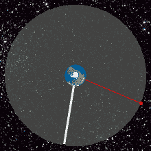
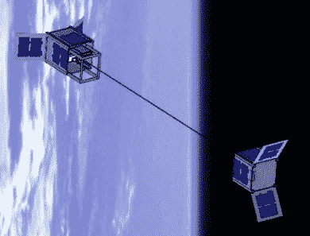

# 太空电梯的一小步

> 原文：<https://hackaday.com/2018/09/14/one-small-step-for-a-space-elevator/>

太空电梯属于那种我们都想在有生之年看到成为现实的技术，但内心深处的怀疑是我们永远无法亲眼目睹的。就像冷聚变或超光速旅行一样，我们理解应该使这些概念成为可能的原理，但它们远远超出了我们的技术理解，它们还不如说是幻想。

 除了，也许没有。当日本宇宙航空研究开发机构(JAXA)向国际空间站发射第七架 Kounotori H-II 转移飞行器时，将搭载一对非常特殊的立方体卫星，为宇航员提供实验和补给。它们构成了世界上第一次太空电梯技术的实际测试，如果运气好的话，这将是以很小的成本进入太空的巨大飞跃之前的许多小步骤之一。

当然，他们不会测试全功能的太空电梯；即使是最激进的时间表也会让我们落后几十年。这将只是对建造太空电梯的一些核心概念的小规模测试，因为我们需要在学会走路之前学会爬行。但是，即使我们不能亲眼目睹第一部实用的太空电梯成功登顶，至少我们可以说我们在第一层。

## 往上走。很高很高

Geostationary orbit animation by [Loo Kang](http://weelookang.blogspot.com/)

在一个完全实现的太空电梯中，一根非常坚固的电缆将轨道平台连接到地球表面。电力驱动的交通工具(通常被称为“攀登者”)将乘坐这条电缆从地面出发，穿过大气层，直接进入太空。没有火箭引擎，没有重力把你固定在座位上。真的，根本不飞。只是以每小时 200 百公里左右的悠闲速度平稳垂直骑行。从身体上来说，这将是一次轻松的旅行，摆脱了传统太空发射的严酷。但这肯定不会很快。

为了让太空电梯工作，“顶层”需要在所谓的地球静止轨道上。这意味着平台的轨道周期将与地球的旋转周期相匹配，给人一种它静止不动地在我们头顶盘旋的感觉(从我们在地表的角度来看)。这与许多通信卫星被放置在同一轨道上，因为它不需要在空中主动跟踪它们。问题是，地球周围的地球静止轨道位于 36，000 公里(22，370 英里)的高度。以 200 公里/小时的速度，攀登者需要一个多星期才能到达那个高度。

## 不合理的要求

你可以想象，考虑到它的尺寸和复杂性，建造一架太空电梯将会非常昂贵:希望在 2050 年建造一架太空电梯的日本公司 Obayashi Corporation 估计它将花费大约 900 亿美元。但是太空电梯是一种基础设施，就像高速公路或铁路线一样。这在一开始要花很多钱，但从长远来看，它能让旅行变得更便宜。据估计，通过定期“爬升”，电梯可以将有效载荷送入太空的成本降至每公斤 220 美元(每磅 100 美元)。这还不到已经非常便宜的猎鹰 9 号火箭的十分之一。

所以它并不是特别快，而且建造它需要很多钱，但是总的来说，对于任何希望摆脱他们进化的岩石的文明来说，它听起来仍然是一个不错的投资。那么，为什么我们没有建立一个呢？简单的答案是，我们不知道怎么做。

虽然这个原理看起来很简单，但材料科学仍然让我们摸不着头脑。建造一枚能够飞向太空的火箭(有时返回，取决于是谁建造的)已经将我们的冶金能力推向了极限。但是一条能延伸 36000 公里而不断裂的电缆超出了我们目前的技术水平。碳纳米管最有希望，但是我们还没有足够的能力用它们来制造。

## 第一次攀登考验我们的勇气

即将到来的测试将使用从国际空间站部署的两颗 1U 立方体卫星(每颗 10 厘米长)作为地球和轨道平台。这两颗立方体卫星将作为一个整体从国际空间站中弹出，但随后将分离并相互远离。它们将由一条 10 米长(约 33 英尺)的钢制系绳连接在一起，然后如果一切按计划进行，一个微型电动攀爬器将试图从一颗卫星移动到另一颗卫星。

Rendering of the STARS configuration.

尺寸只有 6x3x3cm，微型攀登者将是历史上第一个尝试这种操作的物体。理论上，我们已经很好地理解了当小个子骑手开始拉缆绳时会发生什么，但理论和假设在太空中并不总是很好。卫星上的相机将在攀登过程中监控攀登者，并将收集大量宝贵的真实世界数据，以帮助工程师完善未来更大规模测试的计划。

这项任务建立在 JAXA 于 2009 年、2004 年和 2016 年发射的先前[太空绳系自主机器人卫星(STARS)任务成功的基础上。这些任务测试了系绳的部署和稳定性，这也是第一次。在了解了单独的系留飞行器的行为之后，静冈大学 STARS 任务背后的团队现在有足够的信心进入下一阶段。](https://spaceflight101.com/iss-expedition-50/stars-c-cubesat-deployed-from-iss/)

## 世纪雄心

俄罗斯科学家康斯坦丁·齐奥尔科夫斯基于 1895 年首次构想出太空电梯，并在 20 世纪因亚瑟·C·克拉克和罗伯特·A·海因莱因等科幻大师的作品而普及，就“圣杯”太空技术而言，太空电梯仅次于曲速驱动器。有人认为，一旦人类有了一个功能正常的太空电梯，我们就可以在太阳系中开拓殖民地了。

迄今为止，我们实现这项技术的尝试范围有限，但我们可能最终会看到隧道尽头的第一缕曙光。我们还有几十年的时间，所以从想出进入太空的替代方法中[仍然有很多收获。但毫无疑问，我们现在比以往任何时候都更接近淘汰火箭技术，这种技术自二战期间发展以来几乎没有改变过](https://hackaday.com/2018/08/29/stratolaunch-announces-carrier-aircraft-with-largest-wingspan-ever/)[。](http://hackaday.com/2017/11/03/books-you-should-read-v-2-by-walter-dornberger/)