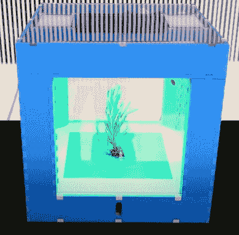

# 开放农业倡议在丑闻中关闭

> 原文：<https://hackaday.com/2020/05/21/open-agriculture-initiative-shuttered-amid-scandal/>

麻省理工学院媒体实验室的开放农业倡议(OpenAg)承诺用他们的食品计算机彻底改变城市农业:本质上是微型自动化花园，可以安装在机架上，以最大限度地增加种植空间。每个单元都将被提供一个“配方”,允许它为它所包含的物种保持理想的环境条件，这意味着即使是新手园丁也能获得大丰收，不管他们是生活在北极圈还是撒哈拉沙漠。

有了如此崇高的目标，成功肯定是没有保证的。但是我们仍然没有预料到，在一系列令人震惊的指控曝光后，这个项目不得不被永久关闭。从参与科学欺诈到引发一场小的生态灾难，故事变得越来越糟糕。谁能想到有一天我们会报道一个与 Jeffrey Epstein 有直接联系的开源项目？

Food Computer v3.0

据报道，麻省理工学院媒体实验室主任伊藤穰一和 OpenAg 首席研究员凯勒·哈珀(Caleb Harper)在 2017 年与这位名誉扫地的金融家会面时，试图为该计划获得 150 万美元的资金。Epstein 显然没有被他所看到的打动，也没有钱被转手。根据我们现在掌握的关于该项目的信息，这可能是故事中最不令人惊讶的部分。

从那以后，人们发现食品计算机从来没有稳定地工作过，事实上从来没有过原型阶段。尽管哈珀在向潜在投资者介绍时声称功能单元已经部署到难民营。一位参与该项目的科学家甚至声称，在参观实验室之前，工作人员被指示将从当地园艺中心带来的植物放入原型食品计算机中，这样参观者就会认为它们是在设备中生长的。

从事 OpenAg 项目的前研究人员 Babak Babakinejad 也公开表达了他对倾倒食品计算机废水的环境影响的担忧。该实验室获得了将注入氮气的水泵入地下处理井的许可，但据 Babakinejad 称，内部测试显示水中的[氮含量偶尔会超过规定限值](https://www.wbur.org/edify/2019/09/20/open-agriculture-initiative-middleton-harper)的 20 倍。在他的担忧被哈珀和其他麻省理工学院的工作人员忽视后，他最终将他的担忧直接带到了马萨诸塞州环境保护局，该局对此进行了调查，并最终处以 2.5 万美元的罚款。

[我们在 2016 年](https://hackaday.com/2016/12/26/openag-is-a-personal-food-computer/)第一次报道了开放农业倡议，读者甚至在那时就对这个概念表示了怀疑。虽然我们肯定不喜欢对我们的特色项目进行这样的更新，但这是一个重要的提醒，诚实和正直不能让位于技术成就。