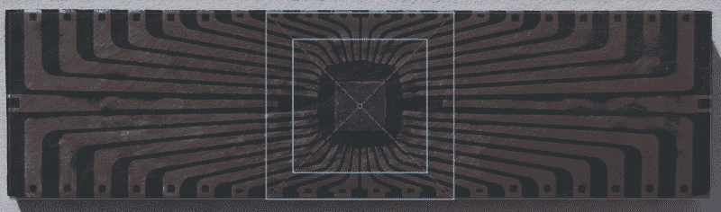

# 开放式手术将复古芯片切割成小尺寸

> 原文：<https://hackaday.com/2021/03/05/open-dip-surgery-cuts-retro-chips-down-to-size/>

至少以今天的标准来看，早期的一些芯片非常非常大。它们可能是革命性的，确实缩小了电子器件的尺寸，但将 40 引脚 DIP 集成到现代设计中可能会有问题。解决方案:[切掉所有多余的塑料，只用模具在](https://twitter.com/redherring32/status/1365734566879780864?s=20)内工作。

 当[Redherring32]提醒我们这项创新时，他并没有包括太多的信息——只是几张 mod 的照片和一些关于目标芯片的简短文字，一个辉煌的 NES 8 位时代的 RP2A03。它生活在相对巨大的 DIP-40 封装中，在紧凑、更现代的设计中占据了太多的空间。因此，不幸的芯片落在刀下，或者更确切地说，Dremel 工具金刚石切割轮。[Redherring32]在骰子周围留下了一个宽大的边界。切开封装后，芯片的引线框架暴露在外，足以焊接 34AWG (0.02 mm)磁线，以便引出引线进行连接。我们担心切割过程中的振动会损坏硅片，但推文中的视频告诉我们事实并非如此。

目前，被释放的芯片连接到一块 perfboard 上，讽刺的是，这实际上使它比原来的芯片更大。但这是一个概念验证，考虑到该操作将芯片的尺寸缩小了约 93%，它应该能够实现一些有趣的应用。或许一个更小、更好的 OpenTendo 版本正在研发中。