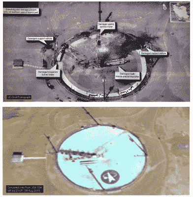

# 开源英特尔帮助揭示美国间谍卫星能力

> 原文：<https://hackaday.com/2019/09/05/open-source-intel-helps-reveal-us-spy-sat-capabilities/>

2019 年 8 月 30 日，美国总统[在推特上发布了一张伊朗航天港](https://twitter.com/realDonaldTrump/status/1167493371973255170?s=20)的图片，记录了最近在该地点失败的 Safir 发射。鉴于图像的高分辨率，这样一张图像的发布引起了人们的惊讶，它似乎是一张机密情报文件的智能手机照片。

好奇的头脑很快跳到这张照片上，试图确定图片的来源。虽然一些人猜测它可能是从侦察机或无人机上拍摄的，但卫星跟踪社区的分析不同意这种说法。

A comparison of the actual image, top, and a simulation of what a shot from USA 224 would look like. Ignore the shadows, which are from an image taken at a different time of day. Note the very similar orientation of the features of the launchpad.

图像中阴影的角度用于确定[图像拍摄的大致时间](https://twitter.com/trbrtc/status/1167538108285501441?s=20)。此外，[通过与谷歌地图](https://twitter.com/cgbassa/status/1167578706379988992)中现有的卫星图像进行仔细对比，可以推断出摄像机的方位角和仰角。军事卫星的位置没有公开，但业余跟踪网络有数据显示，在图像拍摄时，卫星 USA 224 处于类似的方位角和仰角。

随着时间和位置都指向 USA 224，证据似乎是决定性的，这颗 KH-11 卫星负责拍摄图像。上一次被证实的锁眼监控图像的公开泄露发生在 1984 年，这是一次特别罕见的事件。这种泄密行为在情报界经常遭到反对，因为民族国家更愿意将监控能力藏在自己的胸口。Safir 图像表明 USA 224 [的分辨率为每像素 10 厘米或更高](https://twitter.com/cgbassa/status/1167587300638973952)——这一信息可能对其他情报组织有用。

这也不是我们第一次报道以前的机密信息了——这次苏联导弹导引头的拆卸包含了许多秘密。