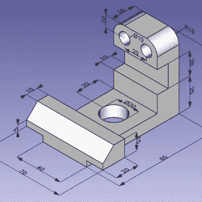

# 开源:是一些小事情

> 原文：<https://hackaday.com/2021/02/13/open-source-its-the-little-things/>

我几乎只使用开源软件；遗憾的是，至少在台式机上，手机是另一回事。我在电脑上做了很多 T2 的事情。当小程序可以自由使用和修改时，自由软件领域之外的人们仍然有点惊讶，但是当涉及到专业软件的大作品时，他们就完全怀疑了。写`xeyes`是一回事，但是能和 Photoshop，或者 Altium 媲美的东西怎么样？

当然，我们都知道答案——大部分都知道。没有一个“大”软件包的工作方式与它们的闭源软件完全相同，经常是这里少了一些功能，那里多了一些功能，或者遵循不同的工作流程。没关系，不同的闭源程序也有不同的工作方式。我在这里不是要争论 GIMP 比 Photoshop 更好，而是要指出我真正喜欢开放软件的地方:它迎合了小男孩女孩、小众用户和专家。或者说，它让他们迎合自己。

 刚开始学 [FreeCAD](https://www.freecadweb.org/) 做一个数控铣削项目，很牛逼。我用过 Fusion 360，虽然 FreeCAD 与 Fusion 360“不一样”，但它拥有我需要的大多数功能。但它与众不同的地方在于其古怪的特征。

核心工作流程是选择一个执行特定任务的“工作台”，然后你把你的部分带到每个工作台，在上面操作，然后移动到你需要的下一个工作台。但是这里关键的一点是很多工作台是由有特殊需求的人贡献给这个开放项目的。例如，对我来说，我已经使用 [OpenSCAD](https://www.freecadweb.org/) 完成了大部分 3D 打印的 3D 建模，这有点小众，但也是支撑 Thingiverse 定制功能的语言。Fusion 360 无缝导入我的 OpenSCAD 管用吗？[没有](https://forums.autodesk.com/t5/fusion-360-ideastation-archived/openscad-import-export/idi-p/4363440)。FreeCAD 有吗？是的，因为另一个书呆子在我的鞋子里。

然后我开始思考其他大的免费项目。Inkscape 有插件可以让你创建 Gcode 来驱动 CNC 铣床或奇怪的绘图仪。为什么？因为书呆子喜欢蛋机器人。GIMP 为每一个可以想象的图像转换提供了插件——99%的图形艺术家永远不会使用这些东西，所以 Adobe 没有动力去整合它们。

开源让你自己解决问题，并与他人分享你的解决方案。付费、闭源软件的特性是由大众驱动的:“这是我们足够多的客户想要的特性吗？”开源软件的特性是由像我这样的书呆子的古怪想法驱动的。差异万岁！

This article is part of the Hackaday.com newsletter, delivered every seven days for each of the last 200+ weeks. It also includes our favorite articles from the last seven days that you can see on [the web version of the newsletter](https://mailchi.mp/hackaday.com/hackaday-newsletter-649368). Want this type of article to hit your inbox every Friday morning? [You should sign up](http://eepurl.com/gTMxQf)!