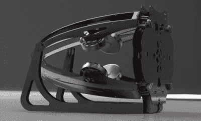

# 使用四轴飞行器技术的开源动力伞

> 原文：<https://hackaday.com/2018/09/17/open-source-paramotor-using-quadcopter-tech/>

你有没有梦想过飞行，但缺乏资金购买自己的飞机，学习的时间，或整个机库和飞机跑道的事情？答案可能是一种叫做动力滑翔伞的超轻型飞机，它由一个柔软的充气机翼和背上的马达组成。你可能已经猜到了，这种发动机被称为动力伞，它可能是现存的最简单的动力飞机之一。通常比大螺旋桨、手持油门和汽油发动机大不了多少。

 但不尽然。OpenPPG 项目旨在制造一种低成本动力伞[，配备电子设备和马达，用于重型多翼飞机](https://openppg.com/)。它提供了相当于气体动力伞 20 至 40 分钟飞行时间的推力，同时更便宜，更容易维护。整个项目是开源的，所以如果你不想购买他们的套件或组装版本，你可以自由使用和混合设计成你自己创造的个人飞机。

一个完整的滑翔伞仍然要花费几千美元，但至少你不需要支付机库费用。由于采用了碳纤维板和一些巧妙铰链的设计，整个东西折叠起来比传统的带有一个大型螺旋桨的动力伞更容易运输和储存。此外，它看起来更酷也没有什么坏处。

不仅电机和速度控制借鉴了四轴飞行器的世界，物理布局也是如此。传统的动力伞受到扭矩问题的困扰，因为大螺旋桨想要反方向扭转马达(人类足够大胆地将它绑在他或她的背上)。这种影响在传统的气动动力伞中得到补偿，方法是将发动机以一定角度安装，以产生抵消推力。但就像四轴飞行器一样，OpenPPG 使用反向旋转的螺旋桨来抵消彼此的推力，消除了飞行员承受的扭矩，简化了滑翔伞的整体设计。

如果你仍然坚持固定翼体验，你总是可以[得到一些泡沫板，并希望最好的](http://hackaday.com/2017/11/01/how-to-build-an-airplane-in-a-month-and-a-half/)。

感谢卢克的提示。]

 [https://www.youtube.com/embed/iOWObMjmRvg?version=3&rel=1&showsearch=0&showinfo=1&iv_load_policy=1&fs=1&hl=en-US&autohide=2&wmode=transparent](https://www.youtube.com/embed/iOWObMjmRvg?version=3&rel=1&showsearch=0&showinfo=1&iv_load_policy=1&fs=1&hl=en-US&autohide=2&wmode=transparent)

