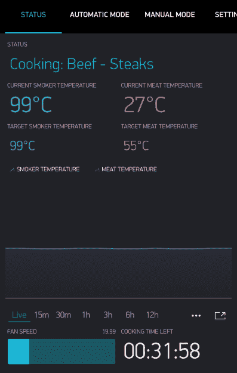

# 开源智能吸烟者带来的热量(缓慢)

> 原文：<https://hackaday.com/2019/09/04/open-source-smart-smoker-brings-the-heat-slowly/>

从概念上来说，在烤架上烹饪很简单:只要把火调大，让食物烤透，但不要烤太久以至于变成不可食用的余烬。但是当吸烟时，目标实际上是完全防止火焰；食物是通过闷烧木头产生的热气循环来烹饪的。如果你想要一顿精心烹制的美味佳肴，你需要耐心和奉献精神来连续几个小时手动保持吸烟者体内的燃料和空气平衡。

 或者在斯莫基·麦克·斯莫克森的例子中，[当你去看电视的时候，你就让电子设备处理所有棘手的事情](https://hackaday.io/project/165762-smokey-mc-smokerson)。这款开源吸烟器由 Raspberry Pi Zero 和一个定制控制板提供动力，能够以 DIY 预算提供高端功能。当然，你仍然需要以传统的方式添加你选择的燃料，但是通过自动气流控制和温度监控，它大大减少了获得完美烟雾所需的繁琐工作。

[HackersHub]已经在 Smokey Mc Smokerson 上工作了几个月，并且非常接近于建立第一个完整的原型。软件的初始版本已经完成，上等的黑色印刷电路板最近也到了。已经进行了一些模拟，以了解烟雾如何在吸烟者自身内部循环，该吸烟者由 55 加仑的鼓制成，但从技术上讲，控制器是一个独立的设备。如果你愿意作出必要的调整，控制器当然可以改装成市售的吸烟者。

最终，这个项目归结为在这个问题上扔一堆温度传感器。由[HackersHub]开发的软件采用五个 MAX6675 热电偶收集的数据，并使用它来确定何时使用吸烟器底部的 PWM 控制风扇将更多空气注入室内。作为额外的奖励，所有这些温度传感器都给用户提供了大量漂亮的数据点，供用户在配套的智能手机应用程序中查看。

这些年来，我们实际上已经看到了相当数量的技术增强的烤架。从这个受汽车启发的“涡轮增压”怪兽到[一个由 PVC 管制成的机器人牛排翻转器](https://hackaday.com/2017/12/30/beefbot-your-robotic-grill-master/)，我们可以自信地说，并不是*所有的*黑客都以微波拉面为食。

The [HackadayPrize2019](https://prize.supplyframe.com) is Sponsored by:     