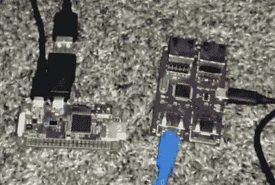

# NES 的轨道跟踪

> 原文：<https://hackaday.com/2020/09/26/orbital-tracking-on-the-nes/>

人们很容易将最初的任天堂娱乐系统仅仅视为一个娱乐系统。但事实上，基于 6502 的控制台并没有远离早期的家用电脑，如 Apple II 和 Commodore 64，任天堂甚至短暂地尝试过创建面向通用计算的软件和附件。虽然最后，马里奥和他的朋友们显然赢了。

尽管如此，我们愿意打赌，任天堂没有人想象过他们勇敢的小游戏系统有一天会被用来跟踪低地球轨道空间站的路线。但这正是[Vi Grey]在他的最新项目中所做的，这是他展示标志性的 NES 的意想不到的能力的整体努力的一部分。虽然你需要一些额外的硬件来在真正的主机上运行这个程序，但是在 1985 年，如果一些开发者想这么做的话，没有什么基本的诡计可以阻止他们这么做。

Raspberry Pi Zero and TAStm32

如果你想看到自己的国际空间站的 8 位视图，最简单的方法是用模拟器。在这种情况下，[Vi]解释了如何在 Mesen 或 FCEUX 中加载他的 Lua 脚本，以便为 ROM 提供来自互联网的必要跟踪数据。

要在真正的 NES 上运行它，你不仅需要[某种类型的 flash cart 来加载 ROM](https://hackaday.com/2019/11/27/bringing-the-nes-cartridge-into-the-usb-age/)，还需要一个 TAStm32 板，用于工具辅助的速度运行。这使得计算机通过模拟快速控制器按钮的按下，将轨道数据基本上“输入”到 NES 中。这似乎是一个很高的要求，但重要的是要注意，这两种设备都不需要您修改原来的控制台；代码本身运行在 100%的股票 NES 上。

如果你对跟踪宇宙飞船不感兴趣，也许你会对[Vi]以前在 NES 上做的一些工作更感兴趣。我们特别喜欢他的多语种 ROM，这是一个有自己源代码的 ZIP 文件。

 [https://www.youtube.com/embed/v6ajzekMzTY?version=3&rel=1&showsearch=0&showinfo=1&iv_load_policy=1&fs=1&hl=en-US&autohide=2&wmode=transparent](https://www.youtube.com/embed/v6ajzekMzTY?version=3&rel=1&showsearch=0&showinfo=1&iv_load_policy=1&fs=1&hl=en-US&autohide=2&wmode=transparent)

