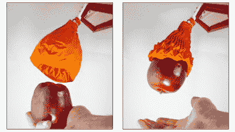

# 折纸夹子非常适合软的和重的物体

> 原文：<https://hackaday.com/2019/03/18/origami-gripper-is-great-for-soft-and-heavy-objects/>

机械臂是令人着迷的设备，在执行任务时有巨大的速度和精度。它们还能够承载巨大的负载，一个全尺寸的工业机器人以最大的速度运行是一个值得一看的景象。然而，虽然设计夹钳来移动坚固的金属物体很简单，但拾取精致或柔软的物体可能会困难得多。麻省理工学院 CSAIL 的一个团队一直在研究这个问题的解决方案，他们称之为折纸夹子。

The gripper is highly capable at lifting objects with complex shapes.

这个抓手由一个灵活的折叠骨架组成，被一个密封的外壳包围着。当施加真空时，骨骼在要被拾起的物体周围收缩。这种抓爪能够抓住直径 70%的物体，重量超过 100 倍。

该设备的制造包括创建 3D 打印模具来生产硅橡胶骨架。结合精确的激光切割和先进的分层技术，这创造了一个在适当条件下可以自我折叠成形的部件。该结构的灵感来自一个“魔法球”折纸设计。相比之下，外层皮肤非常简单——由一个普通的乳胶气球组成。

该团队展示了手爪，展示了一些令人印象深刻的壮举，机器人能够拾取所有形状、大小和重量的物体，而不会损坏。[该文件可在设备上阅读](http://dspace.mit.edu/handle/1721.1/120930)以了解完整的故事。[我们以前也见过使用真空来完成精细的抓取任务](https://hackaday.com/2011/01/25/jamming-gripper-completes-robot-drug-dealer/)。