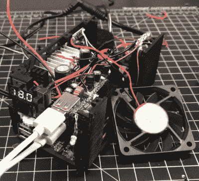

# 过度设计不起眼的 USB 电源组

> 原文：<https://hackaday.com/2019/06/05/overengineering-the-humble-usb-power-bank/>

回到翻盖手机时代，你甚至不用考虑插上电源就能度过整个周末。但是随着移动设备处理能力的提高，它们的能耗也在增加。今天你很幸运，如果你的手机在一天结束回到家之前没有没电。为了避免生活中没有移动设备的恐惧，许多人求助于随身携带小型“能量银行”来保持手机电量充足。

 也就是说，[由【甘乃迪刘】打造的“终极 18650 动力银行”又上了一个全新的台阶](https://www.thingiverse.com/thing:3661580)。只有真正的公路战士需要申请这个特殊的套件。3D 打印的外壳里面是…嗯，几乎所有的东西。它有一个内部逆变器为你的交流设备供电，一个 Qi 无线充电线圈，一个可调的 DC 输出，显示所有相关的电压，自然还有大量的 USB 端口为你的小工具充电。哦，一些 RGB 发光二极管扔在良好的措施。

[Kennedy]将许多硬件打包到这个相对较小的包中，在休息后的视频中，展示了这个电源组内部的一切是如何安排的。将整个事情整合在一起的一个重要部分是 3D 打印框架，它包括所有关键组件的精心设计的插图。因此，如果你想建立自己的版本，你需要得到完全相同的硬件，他用来确保拼图适合在一起。幸运的是，他为此提供了所有相关组件的链接。

现在，你可能想知道将所有这些电子设备包装到一个热塑性外壳中是否明智。但是[肯尼迪]已经考虑到这一点；除了在几乎所有的东西上安装散热器之外，他还增加了主动冷却风扇和一个相当强大的热过载保护方案。通过将热控制开关安装到高输出组件的散热器上，该系统可以在任何太热的东西有机会熔化塑料(或更糟)之前切断电源。

[我们过去见过的大多数 DIY 电源库](https://hackaday.com/2017/05/21/diy-usb-power-bank/)都是[的，只不过是 18650 个电池的简单集合](https://hackaday.com/2017/09/27/monstrous-usb-power-bank/)，所以看到一个包含如此多附加功能的电源库是很有趣的。诚然，引用伟大的达夫·琼斯的话来说，建筑的一些元素是“你好吗”但是经过一些改进，我们认为这将是一个非常方便的设备。

 [https://www.youtube.com/embed/0jRsltIW8qM?version=3&rel=1&showsearch=0&showinfo=1&iv_load_policy=1&fs=1&hl=en-US&autohide=2&wmode=transparent](https://www.youtube.com/embed/0jRsltIW8qM?version=3&rel=1&showsearch=0&showinfo=1&iv_load_policy=1&fs=1&hl=en-US&autohide=2&wmode=transparent)

【感谢 slisgrinder 的提示。]