# 被奇怪的输入淹没:竞赛获胜者和更多

> 原文：<https://hackaday.com/2022/07/13/overwhelmed-by-odd-inputs-the-contest-winners-and-more/>

奇怪的输入和特殊的外设竞赛上周结束了，我们的评委一直在努力筛选他们最喜欢的项目。这并不是一件容易的事情——我们有 75 个参赛作品，其中很多作品本身就很酷，所以我们只能说去把它们都检查一遍。真的。

但我们必须选出获胜者，尤其是因为 Digi-Key 推出了三张价值 150 美元的礼券。所以，废话不多说，这里是前三名的项目和尽可能多的荣誉奖——如果你不算你的拇指的话。

### 获奖者

[Keybon](https://hackaday.io/project/176239-keybon-adaptive-macro-keyboard) 应该是主流的商业产品。这是一个宏键盘，每个键都有一个有机发光二极管屏幕。它与你桌面上的应用程序对话，该应用程序检测你当前关注的程序，并调整按键动作*和*以匹配有机发光二极管标签。这是一个超级光滑的 3D 打印设计。这是[擎天柱](https://en.m.wikipedia.org/wiki/Optimus_Maximus_keyboard)的梦想，但作为一个宏垫，它既可以 DIY，又明显更合理。这是你办公桌上最酷的东西，而且是大赢家！

在键盘可笑的一面，来认识一下 [Cree-board](https://hackaday.io/project/186167-the-cree-board) 。[Matt]说他从名字中糟糕的双关语得到了使用结实的 COB LEDs 作为键帽的想法，但我们喜欢当你按下否则会眩目的光时的效果——它们如此明亮，以至于它们使用你整个多肉的手指作为漫射体。另外，*看起来真的像一个单面煎的鸡蛋。它古怪、独特，在 macropad 中有什么不让人喜欢的呢？*

最后，[乔希·EJ]将一辆[健身车变成了一个无线游戏手柄](https://hackaday.io/project/179905-exercise-bike-to-a-wireless-gamepad-esp32)，通过同时启用两者，消除了在健身和获得高分之间的选择。一个由 ESP32 变成的蓝牙游戏手柄是大脑，他详细记录了他如何连接一个自制的节奏传感器，使用心率垫作为按钮，甚至在上面添加了一些额外的控制。在 *GRID Autosport* 中，看着他为了将虚拟踏板推向金属而全力以赴的片段，我们只希望他在尖叫“vroooom”。

 [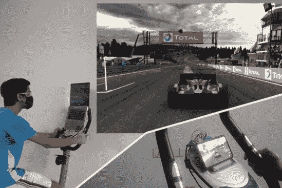](https://hackaday.com/cropped_shot_2022-07-13-182816/)  [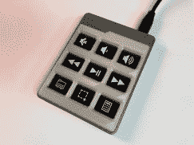](https://hackaday.com/9461581607544609625/)  [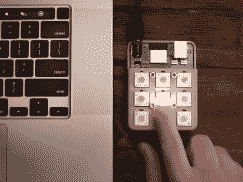](https://hackaday.com/4764691656715137662/) 

#### 奇怪的地形

如果你以打字为生，定制键盘会让你的日常工作个性化。[二分法](https://hackaday.io/project/160704-dichotomy-keyboard-and-mouse)采用桌面的两个标准，鼠标和键盘，并将它们融合在一起，这样你就不必一直把手放在一边。很好。【彼得·莱昂斯】’[Squeezebox](https://hackaday.io/project/186096-squeezebox-keyboard)是他超低行程设计的进一步发展。如果你没有看到[我们对上一次迭代](https://hackaday.com/2021/04/26/where-were-going-we-dont-need-keycaps/)的报道，你以前从未见过这样的事情。最后，我们只需要向马修·斯帕克斯(Matthew Sparks)致敬，感谢他将一把博物馆珍藏的莫尔斯电码钥匙转换成符合 HID 标准的 USB 键盘。嘀哒嘀哒。

#### 更好的老鼠(陷阱)

指针。如果说我们对图形用户界面有什么不满的话，那就是指针。总是指指点点。如果有办法让这变得更有趣就好了……试试[魔棒](https://hackaday.io/project/185731-magic-stick-hid)，它使用一个类似于 Wii 遥控器的红外摄像头作为啮齿动物的替代品。或者是【Maciej Witkowiak】的 [Lightpen to HID](https://hackaday.io/project/179968-lightpen-to-usb-hid-interface) 把一个旧的 Lightpen 带到他的 RetroPie 设置中。或者也许经典鼠标根本没什么问题，你真正需要的是一个定制形状的木制鼠标？当然，你需要自己制作，但是请跟随[的德沃尔格缪伊](https://hackaday.io/project/185801-dwergmuis)。

#### 按任意键

定制外设都是为了适应特定的利基市场，有时这个利基市场是一些小而简单的东西。比如单键键盘？还是有几个键的万向操纵杆？查看[Yannick]的简单外设系列[。[斯文]的](https://hackaday.io/project/185798-diy-input-devices)[微型静音按钮](https://hackaday.io/project/185808-tiny-mute-button)只有一个功能，如果你不算发光的话，而[里奇 T]的[带编码器的 12 键键盘](https://hackaday.io/project/185803-12-button-multi-mode-keyboard-with-rotary-encoder)功能很多，很有风格。[Wing-Sum Law]的键盘看起来[可疑地像一个 NES 控制器](https://hackaday.io/project/186123-nes-shortcut-keyboard)，但是[约翰·雷夫勒]的[音量控制器](https://hackaday.io/project/180043-vo-lum-control)除了一个字面上具体的音量旋钮之外没有任何东西是错的。或者也许你需要整天打数学？[Magne]的[定制键盘](https://hackaday.io/project/186205-math-keyboard)拥有所有弯曲的符号。

#### 电子人

可穿戴设备将个人输入提升到了一个新的水平，【彼得·沃什】的[可穿戴触觉传感器](https://hackaday.io/project/185643-wearable-haptic-sensor)是一个可爱的入口。这是输出而不是输入，让你*感受*计算机在说什么。[Nait]的 [Glovraille](https://hackaday.io/project/185772-glovraille-another-braille-keyboard) 盲文键盘手套仍处于早期阶段，但这是一个很酷的想法，值得一看。

#### 虚拟现实

游戏随着更好的外设而变得更好，我们看到了两个恒星驾驶舱建造:[KSP·盖吉](https://hackaday.io/project/8891-ksp-gegi)为*克巴尔太空计划*(当然)和 [*机甲战士 4* 模拟器驾驶舱面板](https://hackaday.io/project/183809-mechwarrior-4-simulator-cockpit-panel)为，你已经知道了。我们没想到的是两个(2！)定制 *Arkanoid* 控制器。一个[使用一个 slidepot 来更好地匹配游戏](https://hackaday.io/project/186128-arkanavi)，另一个[使用更传统的旋钮](https://hackaday.io/project/170652-digiarka)，但两者都支持 [MSX 计算机架构](https://en.wikipedia.org/wiki/MSX)，我们认为它拥有最好的 *Arkanoid* 版本？

 [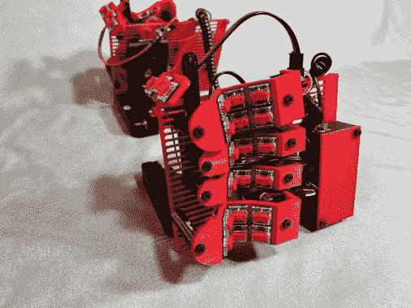](https://hackaday.com/651081656371105266/)  [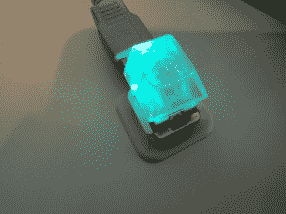](https://hackaday.com/7788021654804356946/)  [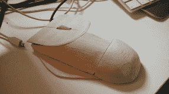](https://hackaday.com/2903291654764594454/)  [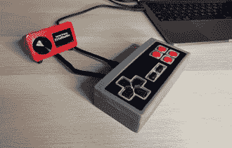](https://hackaday.com/6531941656925539078/)  [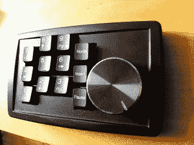](https://hackaday.com/232271654770011534/)  [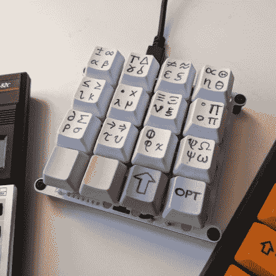](https://hackaday.com/7337321656965831691/)  [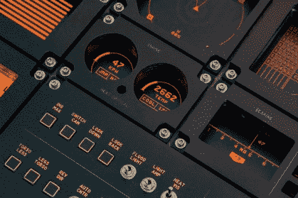](https://hackaday.com/5228311656273034165/)  [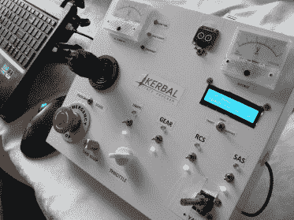](https://hackaday.com/3943011492985899403/)  [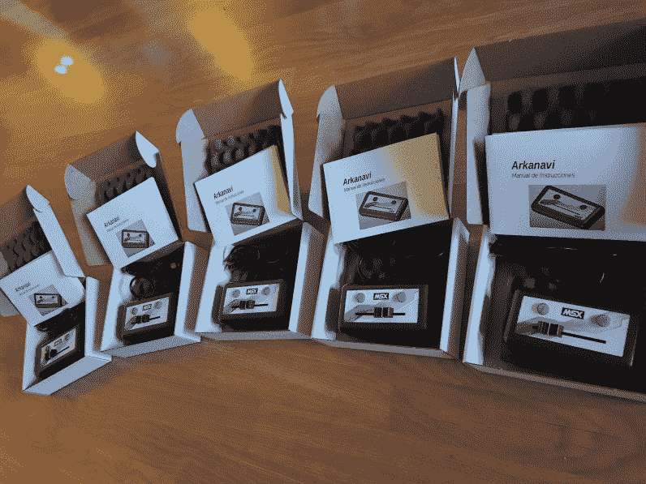](https://hackaday.com/4914421656501382034/) 

而这些只是我们的评委能达成一致的选择。有更多的项目恰好满足了一位评委的幻想，这也是你对这些超个人黑客的期望。所以把它们都检查出来，让我们知道你希望哪些额外的项目出现在列表中！

再次感谢 Digi-Key 赞助本次比赛。

