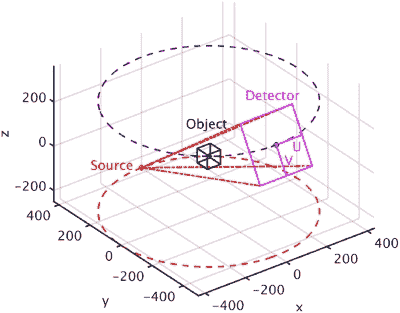
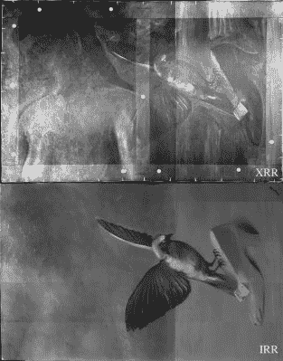

# 画完了但没有忘记:用辐射和数学修复丢失的画

> 原文：<https://hackaday.com/2022/01/04/painted-over-but-not-forgotten-restoring-lost-paintings-with-radiation-and-mathematics/>

绘画的一个内在属性是它们是实物，这使得它们既精彩又令人讨厌。有时，它们作为那个时代令人惊叹的人工制品跨时代流传下来，但它们也容易丢失，甚至被毁坏。有时这种破坏是故意的，比如当一幅画被涂掉的时候。

艺术家一直在重复使用画布——在已经存在的东西上作画。有时，他们可能会被客户胁迫修改画作，或从场景中删除整个元素。幸运的是，现在我们有许多技术，包括 x 射线和红外辐射，可以分析绘画，不仅可以确定我们肉眼可以看到的组成，还可以确定下面的东西。

在某些情况下，我们可以重建之前被隐藏的东西，返回到物理现实绘画和素描，这些绘画和素描有时已经几个世纪没有出现过了。

## 画就像洋葱

绘画是一种添加方法，这意味着从空白画布或其他表面开始，在一个或多个层中应用颜料，这些层可能与其他层重叠。当在现有的绘画上绘画时，新的绘画倾向于应用在这些现有层的顶部。虽然这可能会模糊人眼最初看到的内容，但可以无损剥离这些层，并单独分析它们。

主要的方法是使用 x 光和红外线。几十年来，这意味着要么从整幅画中创建一个 x 射线图像，要么用红外光照射作品并捕捉反射图像。虽然这提供了一些肉眼无法看到的细节，但这些方法无法区分油漆层，也无法区分细节，如特定类型的含铅油漆。更新、更复杂的方法可以提供这种信息。

这些方法的一个很好的概述来自于 [Stijn Legrand 等人](https://heritagesciencejournal.springeropen.com/articles/10.1186/2050-7445-2-13) (2014)发表在*遗产科学*上的一篇论文。以一幅 15 世纪的[三联画](https://en.wikipedia.org/wiki/Triptych)(折叠三面祭坛画)为例，展示了这幅作品是如何在多年间经历多次修改的。这些改动主要包括添加更多的家庭成员，并在画的周围移动现有的人物以腾出空间，这掩盖了已经画进去的背景。一些女性角色的服装后来也做得更加朴素，大概是在其中一个女儿成为修女之后。

The Moreel Triptych, 1485, H. Memling (Groeninge Museum, Bruges, Belgium). (A) Photograph; (B) the M6 MA-XRF scanning in front of the right panel; (C-E) MA-XRF images of part of the left panel, showing Mrs. Moreel and her daughters (ca 60×40 cm2); (F) close-up of the right panel, showing W. Moreel and his sons (ca 40×40 cm2); (G-H) corresponding MA-XRF images; (I) scheme clarifying the shift of the position of the eldest son; step size: 1 mm in both directions; dwell time: 0.5 s/pixel. (Credit: Stijn Legrand et al., 2014)

这些信息是从宏观 X 射线荧光(MA-XRF)扫描中收集的，该扫描使用 X 射线来电离材料。电离后从材料中发出的辐射表明存在哪些基本元素，如铅，以及存在的量。由于每种类型和颜色的涂料是由这些元素的不同混合物组成的，这使得我们可以将隐藏的层视为一种鬼影，尽管 MA-XRF 对层不敏感。

虽然非常有用，但有一种方法也可以获得所用涂料的准确成分:宏观 X 射线衍射(MA-XDR)。这种方法不是使用放置在画后面的传感器来跟踪荧光，而是将传感器与前面成一定角度放置在 X 射线源旁边:

[![Prototype MA-XRD setup at the University of Antwerp. A) Photograph showing the micro-focus X-ray tube source (S), equipped with a double curved mirror M and detector for recording transmission XRD (D1) and XRF (D2) data: these components are positioned close to a painting mounted on a motorized stage; B) MA-XRD and C) MA-XRF images obtained by scanning a detail of the painting shown in D): scan size: 78×75 mm2, image step size: 0.5 mm in both directions, Dwell time: 2 s/pixel. Adapted from [Vanmeert F, Janssens K, De Nolf W, Legrand S, Van der Snickt G, Dik J: Scanning Macroscopic X-ray powder diffraction imaging (MA-XRPD): transfer from the synchrotron to the laboratory, submitted]. (Source: Stijn Legrand et al., 2014)](img/bd29f416492225082c2b732952648c2f.png)](https://hackaday.com/wp-content/uploads/2021/12/40494_2014_Article_40_Fig3_HTML.jpg) 

安特卫普大学样机 MA-XRD 设置。a)显示微焦点 X 射线管源的照片，配有双曲面镜 M 和用于记录透射 XRD (D1)和 XRF (D2)数据的检测器:这些部件靠近安装在电动台上的油画放置；B) MA-XRD 和 C) MA-XRF 图像通过扫描 D)中所示的绘画细节获得:扫描尺寸:78×75 mm2，图像步长:两个方向上 0.5 mm，停留时间:2s/像素。改编自【范梅尔特 F，扬森斯 K，德诺尔夫 W，勒格朗 S，范德斯尼克特 G，迪克 J:扫描宏观 X 射线粉末衍射成像(MA-XRPD):从同步加速器转移到实验室，提交】。(资料来源:Stijn Legrand 等人，2014)

结合使用 XRF 和 XRD，不仅可以识别连续的油漆层，还可以确定其中许多油漆层的确切化学成分，从而区分过去几个世纪使用的许多含铅颜料。此外，红外辐射——高光谱配置中的近红外和中红外——通常用于获得 X 射线方法可能遗漏的额外细节。

## 剥回层

但是让我们更深入一点。前面提到的所有基于 X 射线和红外线的方法的共同点是，它们不区分绘画的各个层。但是就像你可以从多个角度给人拍 x 光一样，你也可以在艺术上使用计算机断层扫描。

对于传统的 CT 扫描来说，扫描仪或对象旋转以使射线照片可以从尽可能多的角度拍摄当然是必要的。虽然这对于基本上圆形的人体和类似的形状很有效，但是像绘画和复合材料面板这样的平面物体不能以这种方式扫描。在这里，我们看到，在过去的几年里，艺术和材料研究领域进行了一系列的研究，试图将传统的 CT 扫描改造成能够处理这些扁平物体的形式。这就引出了计算机断层摄影术(CL)。

[Charles E. Wood 等人](https://ieeexplore.ieee.org/abstract/document/8629274) (2019， [PDF](https://www.175722.com/415613/2/Laminography_v04.pdf) )报告了在碳纤维增强聚合物(CFRP)截面上进行化学发光的两种不同方法。这里的目标是检测复合材料中的缺陷，如气泡和裂缝。使用六足机器人和机械臂设置，进行 CL 扫描，遵循光栅和有限角度扫描模式(与 CT 的全旋转相反)。然后使用同步迭代重建技术(SIRT) [迭代重建](https://en.wikipedia.org/wiki/Iterative_reconstruction)算法将数据组装到计算模型中。

The path of the source and detector during the scan in the
object’s frame of reference xyz. (Source: S.L.Fisher et al., 2019)

虽然这给出了有用的结果，但是不精确的定位和减小的角度在最终模型中引入了伪像。 [S. L. Fisher 等人](https://iopscience.iop.org/article/10.1088/1361-6501/aafcae) (2019)参考 Wood 等人的一项研究，该研究使用实验室中发现的 CT 扫描设备，并对受试者使用单一旋转轴。

这种方法似乎避开了 CT 和 CL 配置的许多限制。通过允许被扫描物体的完全旋转，这允许基本上全范围的角度，同时提供稳定的平台，而没有 Wood 等人遇到的位置困难。

尽管仍然只是一个概念验证研究，Fisher 等人提出的方法表明，有相当简单的方法来实现 CL，而不需要使用昂贵的设备或复杂的扫描设置。

## 恢复失去的东西

XRR and IRR of Dieu n’est pas un saint, in landscape orientation, revealing a truncated female nude (from above the head to the lower breast) beneath the current picture. (Credit: Catherine Defeyt et al., 2018)

多年来，像这样的方法已经被艺术保护者和其他人用来不仅理解一幅画的物理构成，而且理解所使用的技术。特别是使用 CL，可以看到用于实现特定效果的笔触和层次感。通过使用 XRD 来分析过度着色部分中使用的特定颜料，甚至可以重建该部分的准确颜色。这对于重建勒内·马格里特(1898-1967)的 *La pose enchantée* 至关重要，正如 [Catherine Defeyt 等人](https://heritagesciencejournal.springeropen.com/articles/10.1186/s40494-018-0198-x) (2018)所记录的

这幅画创作于 1927 年，大约在 1932 年消失。众所周知，马格里特的经济状况导致他经常重复使用旧作品。通过检查这位艺术家的其他作品，在 X 射线和红外扫描中发现，这幅消失的画作实际上已经被切割并用于新的作品。

重建这幅作品包括扫描现有的画作以找到单独的作品，将其与作品切割前拍摄的单色照片进行匹配，并使用 XRF 确定原始绘画层使用的颜料。然后将这些信息组合起来，重建原始的全彩画作的样子。即使这不会带回原来的作品，但它确实让我们深入了解了它的原貌。

## 保持真实

在艺术的世界里，一切都关乎真实性。每当一些大师的“先前未知”或“假定丢失”的作品浮出水面，关于它是否真的是这位画家的争论开始时，这一点就变得非常明显。一个有趣的方面是，一个先前丢失的副本的重建的物理版本是否与原件有任何共同之处。例如，最近有报道称，一幅丢失的毕加索作品被用一个神经网络重建[，这个神经网络是根据毕加索的其他作品训练的，也许最好把这些作品看作是复制品。](https://www.ucl.ac.uk/news/2021/oct/ai-used-reproduce-lost-picasso-nude)

几年前，史密森尼杂志报道了七件丢失的杰作的重建。这项工作使用了任何现有的照片和目击者的证据，以及画家的技术知识来重新描绘这些作品。尽管我们知道这些作品尽可能接近原作，但我们也知道它们并非真正出自梵高、莫奈或其他大师之手。

即便如此，对于拥有一份曾经被认为永远遗失的历史的实物拷贝，还是有很多话要说，不管关于一件艺术品真正价值所在的争论持续了多长时间。