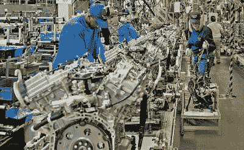
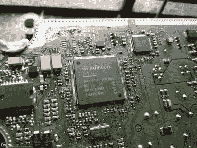

# 疫情芯片短缺导致汽车生产停止

> 原文：<https://hackaday.com/2021/01/18/pandemic-chip-shortages-are-shutting-down-automotive-production/>

曾几何时，汽车主要是机械兽，但现在不再是了。先进的电子设备已经融入现代汽车，从发动机到信息娱乐和气候控制，再到现在遍布客舱的按钮。舒适性和效率的提高不容忽视，但它让制造商依赖半导体供应商生产汽车。在过去的一年里，事情变得更加复杂——许多汽车制造商不得不在面临集成电路短缺的情况下放缓生产，这可以追溯到 2020 年春天。

## 短缺在供应链中蔓延

Production lines are set up for just-in-time manufacturing, where parts are delivered as needed. If there’s a delay in the supply chain, everything quickly grinds to a halt.

毫不奇怪，这种情况的责任可以坚定地归咎于正在进行的冠状病毒疫情。由于工厂关闭，汽车制造商被迫缩减生产，以避免传播致命病毒。这意味着削减供应商的订单，特别是现代汽车生产的准时性意味着工厂几乎没有空间来储存多余的零件。与此同时，在锁定初期，汽车销量下降，因为在 2020 年 3 月和 4 月的动荡期间，很少有人考虑购买新车。

在同一时期，随着学校和企业转向远程操作，对消费电子产品的需求飙升。网络摄像头从商店货架上飞了下来，公司花了大量的钱给他们的员工配备笔记本电脑，使他们的员工能够在家工作。由于这一领域的短缺，半导体代工厂将生产线转向生产需求量最大的零部件，减少了对订单减少的汽车制造商的零部件供应。

随着时间的推移，对新汽车的需求增加了，这通常是因为人们普遍害怕接触病毒，导致消费者避免乘坐公共交通工具。芯片代工厂产能有限，无法简单地制造更多芯片；相反，汽车制造商不得不停止一些生产线的生产，以等待交货来满足需求。

本田、丰田、菲亚特-克莱斯勒和福特都受到了短缺的影响。一级供应商博世注意到，用于发动机和变速器控制单元的零件短缺尤为严重。由于这些零件专门用于汽车应用，它们相对较小的市场可能意味着代工厂首先专注于运输消费品零件，因为它们的产量较高。由于交付周期以月计，汽车制造商可能需要一段时间才能恢复满负荷生产。

## 你需要每一部分来完成建造

Semiconductor manufacturers like Infineon and NXP count automakers as some of their major customers, with their chips finding their way into everything from engine control units (pictured) to infotainment systems and seat controls.

这不是汽车制造商第一次面临短缺，也不会是最后一次。[2018 年，一家镁铸造厂发生火灾，导致多家制造商使用的结构件普遍短缺](https://www.boston.com/cars/car-news/2018/05/11/parts-shortage-ford-more-companies)。2012 年，[一家生产燃料管道涂层化学品的德国公司发生灾难，威胁到减产](https://www.cnbc.com/2012/04/17/global-auto-parts-shortage-threatens-assembly-lines.html)。

虽然关键零部件的冗余供应对汽车制造商来说是可取的，但在现代市场上并不总是可行的。建造芯片制造厂的成本超过 10 亿美元。闲置生产线不赚钱，所以这个行业很少有闲置产能。生产运行提前很长时间排队，启动新运行的准备时间以月计。再加上由于现代供应链的准时性而导致的对保留零件的厌恶，很明显这是一个注定会再次出现的问题。

除非全球范围内的汽车制造文化发生重大转变，否则短缺不会很快消失。取而代之的是，普通消费者将不得不为新车下线多等一会儿，汽车制造商将不得不不停地打电话给供应商，让他们把零件装上船。当然，如果你自己是一个纸上谈兵的物流学家，请在评论中说出你解决这个难题的最佳想法！