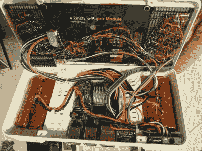

# Paper Pi 是一个符合人体工程学的电脑平台，专为拇指设计

> 原文：<https://hackaday.com/2021/04/27/paper-pi-is-an-ergonomic-cyberdeck-meant-for-thumbs/>

掌握像`screen`或`emacs`这样的控制台东西最快的方法是什么？当然是强迫自己独占使用。但是也许你会想用台式机作弊。我们知道我们会的。在这种情况下，你应该给[建一个只有控制台的虚拟平台，就像这个可爱的小东西](https://gitlab.com/norris.daniel/paper-pi-handheld)一样。

 这个 cyberdeck 还有另一个用途——键盘布局是 [Miryoku](https://github.com/manna-harbour/miryoku) ，所以【a8ksh4】可以同时用那个得到更多的练习。好在布局是为`emacs`打造的。

里面是一个 Raspberry Pi 4 和一个处理键盘输入的 Arduino。Paper Pi 在一个由柔软、安静的触觉开关组成的分离式拇指键盘之间突出了一个 4.2 英寸的电子墨水屏幕。

由于它们是 SMD，[a8ksh4]巧妙地利用了接头引脚，使它们能够与 protoboard 一起工作。尽管我们热爱键盘，但如果能在肩膀上甚至后背上看到一些开关来利用其余的手指，那就太棒了。[在图库中查看更多建筑图片](https://imgur.com/a/ck2DkrF)。

我们喜欢看到带有分离键盘的电脑平台，因为你不应该牺牲便携式电脑的人体工程学。[这里有一个分为三部分的盒子，可以很容易地将两半之间的间距保持在合适的位置](https://hackaday.com/2021/04/08/three-piece-cyberdeck-plays-the-role-of-military-computer-that-never-was/)。

Via [r/cyberdeck](https://www.reddit.com/r/cyberDeck/comments/mxpej7/paper_pi_eink_handheld/)