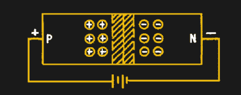
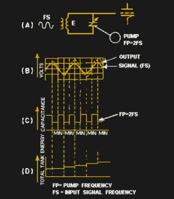
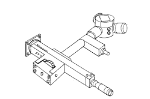

# 参量放大器和变容二极管

> 原文：<https://hackaday.com/2019/04/26/parametric-amplifiers-and-varactors/>

很难想象一个没有积极放大的时代。然而，如果你追溯到足够远的过去，无线电通信开始于产生射频需要火花隙之类的东西的时代，只有在天线处信号足够强的情况下才可能接收，就像晶体收音机一样。过了几年，电子管才允许发射和接收的信号都被电子放大，而工作在无线电频率的晶体管出现则需要更长的时间。然而，即使是有源器件也有其局限性，而参量振荡器和放大器可以解决这些问题。

这在 20 世纪 70 年代更受欢迎，当时很难获得能在非常高的频率下工作的晶体管。当您需要极低的噪声放大时，它们仍然有用。此外，同样的效应也用于光学设备中，你甚至可以在机械设备中观察到这种效应。

## 到底是什么？

短语“参数的”意味着放大或振荡是由于系统参数的变化而发生的。一个简单的例子是可变电容器。我们知道电容器中的电荷等于电容乘以单位电压。这也意味着，如果电荷已知，我们可以通过将电荷除以电容来知道电压。用数字来表示，如果一个 0.1 法拉的电容器上有 12V 的电压，则电荷为 1.2 库仑。假设我们的输入信号是 12V，我们让电容充电到这个值。然后我们转动电容器的旋钮，使其值为 0.05 法拉。电荷不会改变，所以现在电容器上有 24 伏电压。那是 2 倍的放大。当然，这些值是不实际的。不断地转动电容旋钮来放大也是不现实的。然而，它很好地模拟了参量放大器的工作方式。

## 在实践中

在实际电路中，参数通常是电容，但也不是必须如此，而是变容二极管提供可变电容，而不是机械可变电容。如果你没怎么用过变容二极管，这个想法很简单。当二极管反向偏置时，阳极和阴极之间有一个小的绝缘间隙(见下图)。这意味着反向二极管具有电容。一般来说，反向电压越高，改变电容的间隙越宽。变容二极管是利用这种效应优化的二极管。

变容二极管参量放大器有两个输入:输入信号和改变变容二极管参数的本地信号，即泵浦频率。为了工作，泵频率应该至少是输入频率的两倍。典型的配置将具有三个不同的调谐电路。一个调谐到输入频率，一个调谐到泵浦频率，一个调谐到期望的输出频率。

由于输入信号将与泵频率交叉调制，因此放大器同时充当混频器也就不足为奇了。这使它成为一个伟大的转换器，正如[娱乐电子项目]的这个优秀项目中所看到的。在该设计中，7 MHz 信号被馈入一对用 66 MHz 泵泵浦的变容二极管。然后对输出进行滤波，获得 73 MHz 输出信号。当然，你也会得到一个差频和一些基本面，但过滤会选择出来。

 如果你深究数学，你会发现对待参量放大器有两种方法。简并情况是泵浦频率恰好是输入频率的两倍。非简并情况涵盖了泵浦频率不简并的情况。操作是相似的，但是控制数学和结果增益是不同的。通常，在退化情况下更容易理解系统如何工作，但是建立非退化系统更实际。然而，如果你真的看到一个退化的系统，它通常不会有所需输出频率的调谐电路(有时被称为空载)。

简并情况更容易理解，因为泵浦频率在每个完整周期出现两次，向系统添加能量并跟踪输入(如图所示)。非简并情况以类似的方式工作，但是对于相位对准不太关键。然而，它确实需要更多的电路。

## 历史

迈克尔·法拉第(Michael Faraday)在 1831 年研究响着的酒杯时，第一个报告了一个频率的振荡是如何被两倍频率的信号放大的。直到 1892 年，乔治·弗朗西斯·菲茨杰拉德才把这个想法应用到电路中。

当然，那些早期的实验没有使用变容二极管。他们使用发电机和不同的感应器。20 世纪初，paramps(参数放大器的另一个名称)被用于低频无线电传输系统，采用铁芯电感作为电抗元件。

变容二极管出现在 1956 年，与以前使用的电感器不同，它们可以支持微波范围内的频率。西方电气公司的马里恩·海因斯用这种新设备制造了一个微波放大器。

说到历史，我们谈到了多产的固态先锋鲁弗斯·p·特纳。他写了一本关于变容二极管的书，你可以在网上[找到。](https://www.americanradiohistory.com/Archive-Bookshelf/Author-Groups/Rufus-Turner/ABC's-of-Varactors-Rufus-Turner.pdf)

## 优势

因为 paramp 改变的是电抗而不是电阻，所以它避免了由电子管或晶体管引入的几种常见噪声源。这使得放大器可以用于雷达和太空相关的无线电，如射电望远镜和卫星接收器。特殊的设计技术——桥接电路和冷却——可以使电路达到非常低的噪声系数。

事实上，放大器还可以充当混频器，这在接收机设计等需要产生中频的场合是一个优势。另一个优势是 paramp 不需要直接电源。所有的能量都来自泵浦振荡器(当然，也有一部分来自输入信号)。据推测，泵振荡器将需要电源。

## 今天

可以在非常高的频率下工作的晶体管越来越多，这使得参量放大器不太常见，除非有严格的低噪声要求。也许是因为重要性的降低，你能找到的关于这个主题的很多东西都很旧了。事实上，最好的[实用文章](https://books.google.com/books?id=yFo6DwAAQBAJ&pg=RA3-SA2-PA45&lpg=RA3-SA2-PA45&dq=neets+varactor&source=bl&ots=dYJRLKl9qT&sig=ACfU3U2ao5hvLcLLgP25P1rC-yLth4KK7w&hl=en&sa=X&ved=2ahUKEwitmpS96qThAhXGUt8KHUzrCf4Q6AEwBXoECAgQAQ#v=onepage&q&f=false)之一来自海军的[啃老族](https://hackaday.com/2017/06/09/electronics-education-courtesy-of-the-us-navy/)项目，这篇文章中的大部分数字都来自该项目。

 如果你逛逛 hamfests 或剩余商店，你甚至可以找到一个参量放大器模块。它们通常用于微波频率，因此可能会连接到如下所示的波导管上。

变容二极管也出现在许多其他地方。FM 调制器、VXOs(一种可以微调的晶体振荡器)、PLL 压控振荡器(VCO)和跟踪滤波器都经常使用变容二极管。如果你想亲自试验，你可以相对便宜地买到它们。然而，事实是，所有二极管都表现出这种效应。在用于这种服务的二极管中，它是最显著和最有用的(并且有文献记载)。