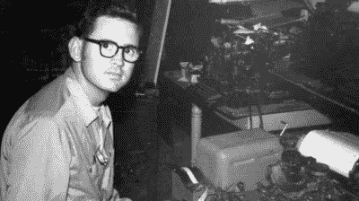
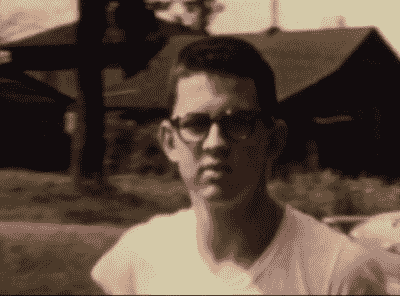
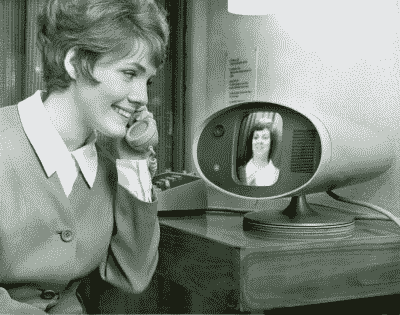
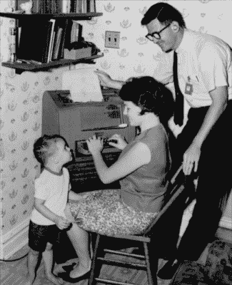
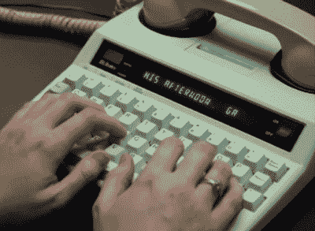

# 保罗·泰勒为听力受损者开通了电信线路

> 原文：<https://hackaday.com/2021/02/23/paul-taylor-opened-the-lines-of-telecommunication-for-the-hearing-impaired/>

如今，几乎每个人都通过某种键盘进行交流，无论是发短信、发电子邮件还是在各种互联网论坛上发帖。在这一点上，通过电话交谈几乎已经过时了。但就在几十年前，电话还是实时通讯的王者。它过去是，现在仍然是一项伟大的发明，但不幸的是，这项技术让听力和语言障碍群体陷入了沉默。

Paul and an early TDD. Image via [Rochester Institute of Technology](https://www.youtube.com/watch?v=U2_skVb8Qpw)

工程师兼教授保罗·泰勒生于 1939 年，在人工耳蜗植入或要求测试和早期识别婴儿听力障碍的法律存在之前很久就已经失聪了。三岁时，他的母亲把他坐火车送到圣路易斯，住在一所名为中央聋人协会(CID)的寄宿学校。

在这里，他配备了一个原始的助听器，学会了读唇语、说话和使用美国手语。当时，这是聋人和听力受损儿童的标准计划——在这样的学校学习十年左右，毕业时获得他们在公立高中和大学取得成功所需的社会和学术工具。

大学毕业后，保罗成了一名工程师，在业余时间，他还为聋人团体争取权益。他是聋人电信设备的先驱，在美国被称为 TDD 或 TTY 设备。晚年，他帮助起草了立法，成为 1990 年美国残疾人法案的一部分。

[保罗于 2017 年被诊断出患有老年痴呆症，于 2021 年 1 月去世，享年 81 岁](https://www.oregonlive.com/health/2021/02/he-died-in-portland-his-legacy-of-helping-the-deaf-communicate-with-the-world.html)。他始终相信，一个聋人获得的技术越多，他们的生活就会越好，他一生中的大部分时间都在试图利用技术来改善聋人的体验。

High school-aged Paul. Image via [YouTube](https://www.youtube.com/watch?v=j6LfG7dpK08)

## 学习不听而说

三岁的保罗在 CID 上学后不久，他遇到了一个名叫萨莉·休利特的小女孩，她有一天会成为他的妻子。在接下来的几年里，他们和他们的同学一起，通过将手放在老师的脸上感受说话的振动，然后在模仿动作和声音的同时触摸自己的脸来学习说话。

保罗的父亲在他还在上学的时候就去世了。他的母亲搬到圣路易斯和儿子在一起，这样他仍然可以上学，但住在家里。她抓住机会在 CID 学习，并成为了一名合格的聋哑儿童教师。到了上高中的时候，保罗和他的母亲搬到了休斯顿，在那里她开办了一所聋哑学校，他第一次进入了公立学校。保罗没有翻译，也没有任何帮手。

在泰勒最小的女儿 2007 年制作的纪录片中，保罗讲述了他在高中的一段经历。他班上有一个漂亮的女孩，他想更多地了解她，所以他问另一个女孩她是谁。当那个女孩主动给保罗第一个女孩的电话号码时，他停下了脚步，在那一刻意识到他是多么的与众不同，因为他不能像其他孩子一样使用电话。这段经历一直伴随着他，并帮助推动了他一生的工作。

AT&T’s Picturephone as it premiered at the 1964 World’s Fair. Image source: AT&T Archives and History Center via [LA Times](https://www.latimes.com/opinion/op-ed/la-oe-brody-world-fair-mother-deaf-20140518-story.html)

### 所有人的电话

高中毕业后，Paul 于 1962 年从佐治亚理工学院获得了化学工程学士学位，并搬回圣路易斯，在华盛顿大学获得了运筹学硕士学位。与此同时，在圣路易斯上高中的莎莉获得了家政学学士学位，并回到 CID 教授体育、宗教和家政学。当保罗得知莎莉住在镇上时，他立即和她取得了联系。他们开始约会，半年后订婚。

1964 年，保罗带莎莉去纽约皇后区的世界博览会庆祝他们的一周年纪念日。他们对& T 的可视电话惊叹不已，希望未来能早点到来，这样他们就可以在任何地方通过阅读对方的唇语轻松交谈。白天，保罗是麦道公司的工程师，后来是孟山都公司的工程师。在家里，他是一个与众不同的工程师，设计不同的方法来帮助抚养他们的三个听力正常的孩子。在他们的第一个孩子出生后，保罗建立了一个系统，可以让房子里的灯闪烁，让他们知道孩子在哭。

Paul, Sally, and their son David along with one of the first teletypewriters that was repurposed as a telecommunication device for the deaf. Image via [Rochester Institute of Technology](https://www.rit.edu/ntid/sites/rit.edu.ntid/files/focus-mag/Focus_Spr01.pdf)

他还尽自己所能，通过志愿服务来帮助聋人社区。电话问题仍然困扰着他。当他注意到一台二战时期的老式西部联盟电传打字机正落满灰尘时，他有了把它变成一种新型通讯工具的想法。

大约在同一时间，一位名叫罗伯特·威特布雷特的失聪物理学家正在开发一种声学耦合器，可以通过用户电话线传输电传信号。Paul 让 Weitbrecht 给他寄了一个，并为聋人创造了第一个电信设备(TDD)。电话线两端各有一台这样的设备，在其中一台设备上输入的任何东西都会在另一台设备上打印出来。保罗与西方联合电报公司合作，将这些老式电传打字机送到有听力和语言障碍的人手中，并说服美国电话电报公司创造一种中继服务来使用它们。

保罗成立了一个非盈利组织，将这些早期的 TDD 分发给其他的圣路易斯聋人。他请当地的电话叫醒服务来帮忙，[在这个过程中建立了第一个电话中继系统。尽管双方都需要一个 TDD 来进行通信，但这是朝着正确方向迈出的一大步。](https://tdiforaccess.org/paul-taylor-one-of-the-early-tty-activists-dies/)

保罗还做了很多工作，让机器为依赖它们的人们保持运转。电传打字机手册是有帮助的，但是对于外行人来说是非常密集的阅读材料。保罗组织了一个为期一周的研讨会，制作了一本名为《电传打字机变得简单》的图片丰富的手册，帮助人们修理和维护三种常见型号的电传打字机。Paul 在下面的视频中讨论了他与 TDD 开发的个人历史。

 [https://www.youtube.com/embed/U2_skVb8Qpw?version=3&rel=1&showsearch=0&showinfo=1&iv_load_policy=1&fs=1&hl=en-US&autohide=2&wmode=transparent](https://www.youtube.com/embed/U2_skVb8Qpw?version=3&rel=1&showsearch=0&showinfo=1&iv_load_policy=1&fs=1&hl=en-US&autohide=2&wmode=transparent)

## 为聋人群体大声疾呼

1975 年，罗彻斯特理工学院的国家聋人协会给了保罗一个职位，于是泰勒一家搬到了纽约北部。保罗成为了一名计算机技术教授和工程支持团队的主席。退休前，他在那里呆了 30 年。

A more modern TTY. Image via [YouTube](https://www.youtube.com/watch?v=vsQ73575Qp8)

在此期间，他倡导一种全国性的、由接线员辅助的电话中继服务，通过这种服务，聋人和听力受损的人可以与任何人交流，无论对方是否有 TDD。

这个想法是，聋人将使用 TTY 呼叫接线员，接线员将让另一个人接通电话，并通过打出语音呼叫者所说的话并大声读出 TDD 用户所键入的回答，在双方之间来回传递信息。保罗离开教学岗位两年，直接与联邦通信委员会合作撰写法规，这些法规成为 1990 年美国残疾人法案规定的指导方针的一部分。

## 学习如何倾听

在 65 岁的时候，保罗和莎莉在一生的沉默之后决定植入人工耳蜗。他们的小女儿艾琳制作了一部关于他们经历的纪录片，名为 [*Hear 和现在的*](https://en.wikipedia.org/wiki/Hear_and_Now) ，嵌在下面。这是对这一过程的有趣的第一手观察，它不是互联网可能让你相信的立竿见影的治疗方法。在手术引起的肿胀消退之前，植入物不能被激活，这需要大约一个月的时间。大脑可能需要数年时间来适应新的感官信息，并开始区分相关声音和背景噪音。

尽管由于大多数人口袋里的可视电话短信设备，TTY/TDDs 正在退出使用，但它们对沟通的影响仍然存在于我们日常信息中使用的速记中——OIC、PLS 和 THX 比你想象的要古老。

 [https://www.youtube.com/embed/j6LfG7dpK08?version=3&rel=1&showsearch=0&showinfo=1&iv_load_policy=1&fs=1&hl=en-US&autohide=2&wmode=transparent](https://www.youtube.com/embed/j6LfG7dpK08?version=3&rel=1&showsearch=0&showinfo=1&iv_load_policy=1&fs=1&hl=en-US&autohide=2&wmode=transparent)

谢谢你的提示，[祖巴]。