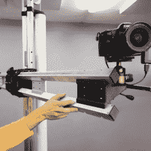

# 向前支付

> 原文：<https://hackaday.com/2020/10/03/paying-it-forward/>

都是那些小事。一个月前，我在做泡沫切割机的轴。(项目停滞不前，将很快回升！)一周前，在互联网上的其他地方，人们正在开发可以直接在铝轨上滑动的滑块，这是我亲身经历的一个问题，他们推荐使用抽屉滑动胶带——一条聚四氟乙烯(PTFE)或 T2 UHMW 聚乙烯(pe)制成的胶带，一侧有背胶。光滑的塑料带解决了金属对金属的问题。很棒，很便宜，而且去五金店也很快。

 就在几天前，我们报道了另一个令人敬畏的线性运动机械构建，它是一个 [DIY 相机装备](https://hackaday.com/2020/09/27/diying-a-high-end-camera-arm/)，它使用了一个与我同样构建的非常相似的线性运动系统:一个印刷的手推车，它在两个方形挤压铝轨道上的滑板轴承上滑动。他有一个非常好的系统来固定将两个轨道分开的垫片，这是我建造中的一个症结。我想我会把东西粘在一起，但他的内部三角形螺母固定器是一个更好的解决方案，因为环氧树脂不喜欢粘在阳极氧化铝上。(亚历山大，如果你正在阅读，UHMW PE 胶带正是你所需要的，可以防止你的铝轴上的轴承磨损。)

在这些事件之间，我收到一条消息，感谢我四年前写的一篇关于调试 SPI 总线的文章。显然，它帮助一家小公司调试了一个问题，并让他们的产品上市了。万岁！

因此，在一周内，我在一个项目上得到了两个不同的陌生人的帮助，他们都不知道我在做什么，我以某种方式挽救了一家初创公司。这是一个什么样的疯狂奇妙的世界？分享我们的想法和经验已经变得如此平常，至少在我们的互联网小角落里是如此，以至于我有时会感到惊讶。但这太神奇了。我知道我们以前说过，但我们生活在分享想法的黄金时代。

感谢你们所有人，并阅读更多 Hackaday！

This article is part of the Hackaday.com newsletter, delivered every seven days for each of the last 200+ weeks. It also includes our favorite articles from the last seven days that you can see on [the web version of the newsletter](https://mailchi.mp/hackaday.com/hackaday-newsletter-649368). Want this type of article to hit your inbox every Friday morning? [You should sign up](http://eepurl.com/gTMxQf)!