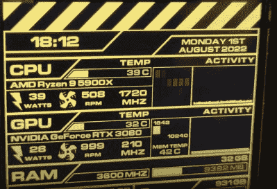

# PC 硬件监视器使用 Tricorder 衍生技术

> 原文：<https://hackaday.com/2022/08/08/pc-hardware-monitor-uses-tricorder-derived-tech/>

[Mangy_Dog]最近为他的新定制 PC 构建的视觉上引人注目的硬件显示器可能看起来像是来自*外星人*系列的东西，但他围绕它构建的硬件实际上来自一个非常不同的科幻财产:*《星际迷航》*。或者至少，从一系列令人印象深刻的*星际旅行*道具中。

 鉴于[【癞皮狗】在开发他的*星际迷航:航海家*三录仪](https://hackaday.com/2022/01/14/improving-an-already-phenomenal-star-trek-prop/)上投入了令人难以置信的大量时间和精力，他决定重用其图形芯片和微控制器也就不足为奇了。虽然熟悉的硬件可能有助于启动这一构建，但这不是一个周末项目。

几个月来，他一直在稳定地工作，甚至在 4 月份的时候还参加了 2022 年的科幻竞赛。显然，他无法在比赛截止日期前完成，但看看最终结果，我们很高兴地看到他一直坚持不懈。

当然，像这样的项目，硬件只是成功的一半。在下面的视频中，[Mangy_Dog]解释了创建在显示器上运行的固件以及附带的 PC 端应用程序所面临的挑战。这包括修改现有的库，以增加对设备独特的闪存存储安排的支持，并将相关的系统状态信息从操作系统中提取出来，放入一系列可定制的小工具中。

尽管这个项目令人印象深刻，[癞皮狗]说他还没有完成。硬件和软件的第二次修订将解决几个问题并增加新的功能，考虑到我们对他的作品的高度期待，我们并不感到惊讶

 [https://www.youtube.com/embed/QGYeBKm4DAI?version=3&rel=1&showsearch=0&showinfo=1&iv_load_policy=1&fs=1&hl=en-US&autohide=2&wmode=transparent](https://www.youtube.com/embed/QGYeBKm4DAI?version=3&rel=1&showsearch=0&showinfo=1&iv_load_policy=1&fs=1&hl=en-US&autohide=2&wmode=transparent)

