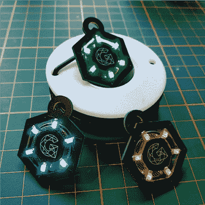

# PCB 首饰从来没有这么好看过

> 原文：<https://hackaday.com/2020/05/16/pcb-jewelry-never-looked-so-good/>

[gautch]想为他的女朋友做些好东西。作为一个 DIY 爱好者，他认为手工制作的礼物比从商店里买的礼物更能引起她的共鸣。进入 NeckLight，黑暗 PCB 项链中的[发光。他最初的灵感来自于他在 Instructables](https://www.instructables.com/id/NeckLight-a-PCB-Necklace-for-Humans-and-Dogs/) 上遇到的另一个项目[，然后决定在设计中加入自己的想法。这种方式很酷。有趣的是，这是他第一次使用 Fusion 360，但如果你看一看结果，你可能不会知道。](https://www.instructables.com/id/LED-Jewelry/)

除了焊接之外，这个项目最棘手的部分是试图让 LED 的亮度恰到好处。[gautch]发现最好的方法是通过实验用一系列电阻测试每种 LED 颜色。他想确保他能获得恰到好处的色彩强度和 LED 电流。最后，用一点丙酮，他就完成了([虽然他下次可能想尝试一些丙酮的替代品](https://hackaday.com/2020/04/29/cheap-alternative-solvents-for-pcb-cleaning/))。

[gautch]也认为这个项目对于初学者来说是学习表面贴装焊接的一个很好的方式。我们以前见过一些很酷的 SMD LED 项目。谁会忘记 DEF CON 上的那些[竞争性焊接挑战？](https://hackaday.com/2018/10/26/competitive-surface-mount-soldering-comes-to-supercon/)

总之。谢谢，[gauchh]。我们希望你的女朋友和你的狗喜欢他们的礼物。