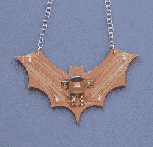

# PCB 工厂生产时尚项链

> 原文：<https://hackaday.com/2020/04/07/pcb-mill-turns-out-stylish-necklace/>

当需要定制 PCB 时，我们大多数人会迅速制作设计文件，并将其发送到板房。价格低廉，周转时间可以忍受，质量在国内难以复制。然而，古老的方法仍然有一些价值，正如这个迷人的发光蜂鸟项链所展示的。

The back side of the pendant neatly hides a button cell battery and a small SMD switch.

这条项链由覆铜板制成，这是那些在家蚀刻自己的 PCB 板的人通常使用的类型。在这种情况下，电路板被放置在[Bantam Tools]轧机上，该轧机有策略地去除铜并切割出最终形状。这在背面为电池、led 和小开关创建了一系列迹线，同时在电路板的另一侧创建了光线可以透过的区域。

安装电池后，项链背面的发光二极管通过玻璃纤维发光，产生美丽的效果。有了 PCB 工厂和回流炉，制作起来也非常容易。当然，如果你喜欢你的零件密度高一点，[这些 FPGA 耳环可能更适合你！](https://hackaday.com/2019/05/24/a-stylish-pair-of-fpga-earrings/)