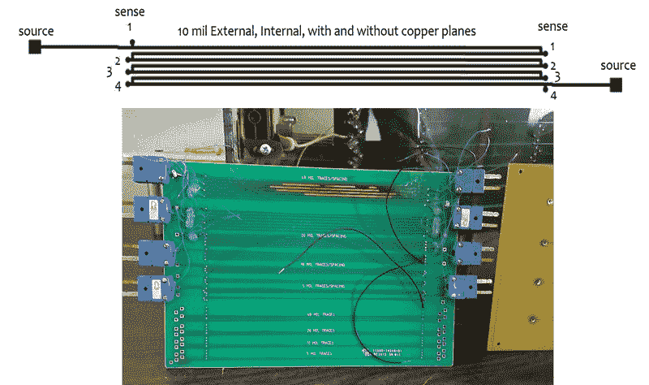

# PCB 热设计黑客变得又热又重

> 原文：<https://hackaday.com/2022/04/08/pcb-thermal-design-hack-gets-hot-and-heavy/>

得益于最近兴起的平价电路板生产服务，许多阅读 Hackaday 的人现在才开始了解 PCB 设计的诀窍。对于那些仍然在制作相当于“Hello World”的 FR4 的人来说，所有的痕迹都在它们应该在的地方，这已经足够了。但是最终你的设计会变得更加雄心勃勃，随着复杂性的增加，自然会有新的设计考虑。例如，在高电流应用中，如何防止 PCB 自身发热？

这正是 Mike Jouppi 在主持上周的黑客聊天时希望帮助回答的问题。这是一个他非常重视的话题，以至于他实际上成立了一家名为 Thermal Management LLC 的公司，致力于帮助工程师解决 PCB 散热设计问题。他还主持了 IPC-2152 的开发，这是一种根据电路板需要承载的电流大小来确定电路板走线尺寸的标准。这不是第一个触及这个问题的标准，但肯定是最现代和最全面的。

许多设计师可能会参考一些可以追溯到 20 世纪 50 年代的数据，出于谨慎，他们简单地放大了自己的痕迹，这是很常见的。Mike 说，这通常是基于他的研究发现不准确的概念，例如 PCB 内部走线往往比外部走线更热的假设。新标准旨在帮助设计者避免这些潜在的陷阱，尽管他指出这对于现实世界来说仍然是一个不完美的模拟；为了更好地了解电路板的热特性，还需要考虑安装配置等其他数据。

即使是这样一个复杂的话题，也有一些足够广泛适用的提示需要记住。Mike 说，与铜相比，基板的热性能总是较差，因此使用内部铜层有助于通过电路板传导热量。当处理会产生大量热量的 SMD 器件时，可以使用大型镀铜过孔来创建平行热路径。

在聊天快结束时， [Thomas Shaddack](https://hackaday.io/shaddack) 提出了一个有趣的想法:既然走线的电阻会随着温度的升高而增加，那么这是否可以用来确定内部 PCB 走线的温度，否则很难测量？Mike 说这个概念是合理的，但是如果你想得到一个精确的读数，你需要知道要校准的走线的标称电阻。当然，这是将来要记住的事情，尤其是如果你没有热感相机可以让你窥视 PCB 的内层。

A rig used to test thermal properties of different trace configurations.

虽然黑客聊天通常是相当非正式的，但这次我们注意到了一些相当尖锐的问题。很明显，有些人有非常特殊的问题需要帮助。在公开聊天中，很难解决复杂问题的所有细微差别，因此我们知道在一些情况下，Mike 会直接联系与会者，这样他就可以一对一地与他们讨论问题。

虽然我们不能总是承诺你会得到那种个性化的服务，但我们认为这是对那些参加 Hack Chat 的人所能获得的独特的社交机会的证明，并感谢 Mike 付出额外的努力，以确保每个人的问题都得到尽可能好的回答。

* * *

Hack Chat 是一个每周一次的在线聊天会议，由来自硬件黑客世界各个角落的顶尖专家主持。对于黑客来说，这是一种有趣和非正式的联系方式，但如果你不能现场直播，这些概述帖子以及发布到 Hackaday.io 的[文字记录确保你不会错过。](https://hackaday.io/event/184333-pcb-thermal-design-hack-chat)