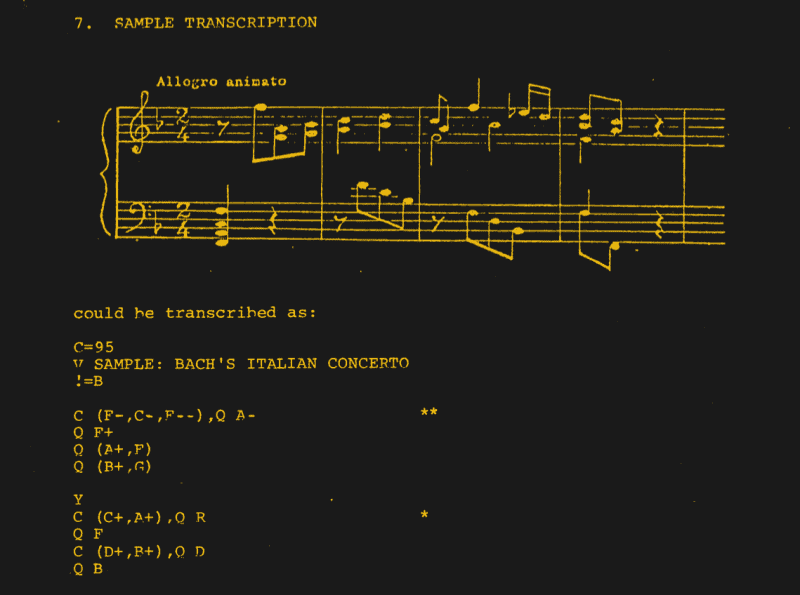

# PDP-8 播放时期爆米花片

> 原文：<https://hackaday.com/2022/12/11/pdp-8-plays-period-popcorn-piece/>

古董技术收藏家凯尔·欧文(Kyle Owen)决定尝试音乐编排——也就是 PDP-8 电脑的音乐编排(请听休息时间下方的[视频)。他正在使用一个由理查德·威尔森在 1976 年提交给数字设备公司用户协会(DECUS)的程序，恰当地命名为音乐。它运行在 OS/8 上，用 PDP-8 汇编语言 PAL8 编写。使用音乐的句法，[凯尔]安排了格尔森金斯利著名的 Moog 合成器热门歌曲“爆米花”(1972 年的热黄油版本)。](https://www.youtube.com/watch?v=6HI5EU_f6RI)

您可能会注意到在他的设置中缺少磁盘或磁带驱动器。这是因为[Kyle]正在使用他在 2014 年编写的 RK05 磁盘模拟器。它运行在 Raspberry Pi 上，通过串口连接，他说这比 RK05 慢，但比磁带机快。他为这次演示连接了一个 Cordovox 放大器柜，但收听音乐输出的原始方式是在计算机附近放一个 AM 收音机(听休息下面的第二个视频)。这是通过以期望的频率(比如 440 Hz)执行 PDP-8 CAF 指令来实现的。

> 因此，当这条指令被执行时，整个计算机的逻辑“嗖”的一声，清空了各种寄存器。现在，如果把收音机靠近电脑，它会获得一些能量，并以每秒 440 次的速度向扬声器发送脉冲。结果是你会从收音机里听到一个音调——事实上，你会听到一个 a。

你可以在[DECUS 提交的原始文件](https://svn.so-much-stuff.com/svn/trunk/pdp8/src/decus/8-804/decus-8-804.pdf)中的原始程序描述中了解关于该程序及其操作的更多信息。

Sample Transcription

 [https://www.youtube.com/embed/6HI5EU_f6RI?version=3&rel=1&showsearch=0&showinfo=1&iv_load_policy=1&fs=1&hl=en-US&autohide=2&wmode=transparent](https://www.youtube.com/embed/6HI5EU_f6RI?version=3&rel=1&showsearch=0&showinfo=1&iv_load_policy=1&fs=1&hl=en-US&autohide=2&wmode=transparent)

 [https://www.youtube.com/embed/akvSE5Z474c?version=3&rel=1&showsearch=0&showinfo=1&iv_load_policy=1&fs=1&hl=en-US&autohide=2&wmode=transparent](https://www.youtube.com/embed/akvSE5Z474c?version=3&rel=1&showsearch=0&showinfo=1&iv_load_policy=1&fs=1&hl=en-US&autohide=2&wmode=transparent)

