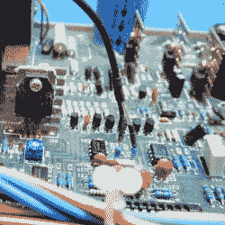

# 窥探这些相同但不同的电源

> 原文：<https://hackaday.com/2019/12/28/peek-inside-these-same-but-different-power-supplies/>

当[Kerry Wong]在易贝发现 90 年代末的 Amrel PPS 35-2 可编程电源时，他意识到这是他拥有的另一个设备的单通道版本，双通道 Amrel PPS-2322。很自然地，他购买了它，[对两种型号](http://www.kerrywong.com/2019/12/01/teardown-of-an-amrel-pps-35-2-programmable-power-supply/)进行了比较和对比。

 从外表上看，它们看起来相当不同，但重量差不多。但是内部的相似性很清楚地表明它们有着共同的设计。有几件事情抓住了你的眼球，35-2 似乎不太*像*一样经过深思熟虑，一些组件被焊接到看起来尴尬的地方。电容器像藤壶一样竖起，直接焊接到连接器上，一滴热胶固定两个电阻，这两个电阻像杂草一样从电路板上伸出来。

上面的链接显示了两种型号之间的一些高分辨率并排照片，并且[Kerry]周到地提供了一个链接到 PPS 系列的手册以及固件的转储[。zip)为 35-2。下面嵌入了拆机视频。](http://www.kerrywong.com/blog/wp-content/uploads/2019/12/Amrel35_2_700B.zip)

台式电源是重要的工具，但我们也看到了[现代试验板电源是如何功能齐全的](https://hackaday.com/2019/04/20/a-breadboard-power-supply-thats-more-universal-than-most/)。

 [https://www.youtube.com/embed/fr3jVm4q3GE?version=3&rel=1&showsearch=0&showinfo=1&iv_load_policy=1&fs=1&hl=en-US&autohide=2&wmode=transparent](https://www.youtube.com/embed/fr3jVm4q3GE?version=3&rel=1&showsearch=0&showinfo=1&iv_load_policy=1&fs=1&hl=en-US&autohide=2&wmode=transparent)

