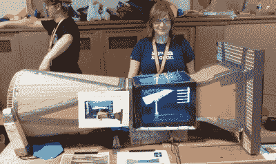
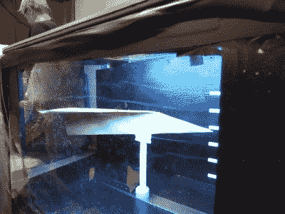

# 完美的纸飞机凝视着有机玻璃大门

> 原文：<https://hackaday.com/2021/05/19/perfecting-paper-planes-peering-past-perspex-portals/>

这个风洞是一堆垃圾，我们喜欢它！当让孩子们接触科学和工程时，它确实有助于表明它不需要一个花哨的研究实验室。【果冻&棉花糖向孩子们展示，只需要纸板、胶带和翻垃圾箱就能让你的纸飞机游戏达到美国国家航空航天局的工程水平。

[Jelly & Marshmallows]使用前面提到的便宜和免费的材料为矫直器、收集器、扩散器和风扇部分建造了他们的制造商集会风洞。我们尤其喜欢使用堆叠式天花板光散射器而不是数百根直管的高效方法。

大部分时间花在工作区，由胶合板框架和丙烯酸窗户定制而成。许多 3D 打印部件聚集在一起，将烟圈枪转换成烟雾轨迹，led 被用来使这些轨迹更容易看到。我们认为用于快速更换飞机的磁性夹子和它们在钢尺上的位置受到了启发。

参加创造者大会的孩子们(我们怀念那些！)喜欢这个展览，最开心的时候是按下一个绿色的大型电扇按钮来启动风扇。是生活中的小事。你如何让孩子们更多地参与空气动力学分析，并让烟雾轨迹更加明显？

感谢您的提示[rómulo anto]