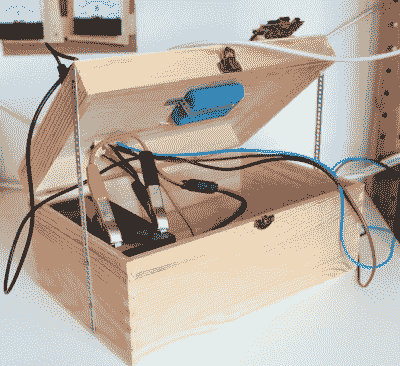

# 完善太阳能网络服务器

> 原文：<https://hackaday.com/2018/10/08/perfecting-the-solar-powered-web-server/>

完全依靠太阳能运行服务器似乎是一件相对容易的事情:扔几块电池板，装上充电控制器和一块结实的电池，你就可以走了。但现实有些不同。我们中的大多数黑客都是在相对有限的预算下运作的，可能没有获得你需要的那种财产来展示大面板；两者都有严重的局限性。做小规模的太阳能发电是困难的，除非你真的提前计划，否则你的装置可能会在第一个阴天就瘫痪。

 因此，当【克里斯·德克尔】想要创建一个太阳能版的网站“低科技杂志”时，他全力以赴。该网站的每一个元素和它运行的硬件都被调查了潜在的节能，对我们来说幸运的是，[整个过程被写得一丝不苟](https://solar.lowtechmagazine.com/2018/09/how-to-build-a-lowtech-website.html)(这里是[非太阳能版本](http://www.lowtechmagazine.com/2018/09/how-to-build-a-lowtech-website.html))。如果天气特别糟糕，服务器仍然会时不时地停机，但一般来说，它在西班牙巴塞罗那保持了大约 90%的正常运行时间。

等式的太阳能一侧相当简单。有一个 50 瓦的光伏板通过一个 20A 的充电控制器给一个 12V 7Ah 的铅酸电池充电。平均每天有 4 到 6 个小时的日照，在最好的情况下，太阳能电池板可以产生 300 瓦时的电能；这需要在给电池充电和运行服务器本身之间进行分配。

至于服务器，[Kris]选择了 Olimex Olinuxino A20 Lime 2，部分原因是它是开源硬件，还因为它非常节能，包括 AXP209 电源管理芯片。根据处理器负载的不同，Olimex 板消耗 1 到 2.5 瓦的功率，加上充电损耗，这意味着该系统可以在阴天运行两天，然后停止运行。未来可能会添加第二块电池，以帮助改善弱光条件下的运行时间，但目前它工作得很好。

也许整个项目最有趣的部分是网站本身被优化到尽可能低的资源利用率。使用抖动压缩图像，以极大地减少文件大小，该网站避免了现代设计，支持处理器密集型的静态布局。通过对 CSS 的巧妙使用，页面中甚至集成了电池容量显示。即使你不打算建立你自己的太阳崇拜网站，这里也有一些建立高效网页的技巧，这些技巧绝对可以在其他项目中使用。

如果你对太阳能项目感兴趣，我们可以帮你搞定。[从开源充电控制器](https://hackaday.com/2018/07/31/high-efficiency-open-sourced-mppt-solar-charger/)到[建造 DIY 光伏板](https://hackaday.com/2018/07/23/diy-vs-commercially-made-solar-panel/)，有大量的现有技术你会发现非常……*有启发性。*请鼓掌。