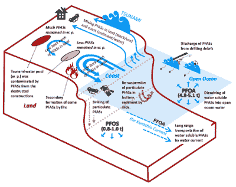

# PFAS:你的生物化学家警告过你的有机氟

> 原文：<https://hackaday.com/2021/11/22/pfas-the-organofluorines-your-biochemist-warned-you-about/>

有时它开始感觉像一种传统，某种物质或一组物质由于某些非常理想的化学或物理特性而变得非常受欢迎，只是这些化学物质随后会对生物圈、人类生活或两者都构成危害。在全氟和多氟烷基物质( [PFAS](https://en.wikipedia.org/wiki/Per-_and_polyfluoroalkyl_substances) )的情况下，没有什么不同。在发现其中的一个亚群——含氟表面活性剂——比其他[表面活性剂](https://en.wikipedia.org/wiki/Surfactant)更能显著降低水的表面张力后，它们开始被广泛使用。

今天，含氟表面活性剂被用于从防污剂到油漆、化妆品和消防队员使用的泡沫等各种物品。最近一项对在美国和加拿大购买的 231 种化妆品的研究( [Whitehead 等人，2021](https://pubs.acs.org/doi/10.1021/acs.estlett.1c00240) )发现，所有化妆品都含有全氟辛烷磺酸，即使包装上没有列出。这里的问题是全氟辛烷磺酸非常稳定，处理后不会腐烂，并在体内生物累积，可能会干扰内分泌。

一些地区现在已经至少部分禁止了 PFAS，但是到目前为止这方面的证据是混杂的。让我们回顾一下在这一点上我们所知道的，以及继续使用这些物质我们有哪些替代品。

## 爱它或恨它

Schematic diagram of a micelle of oil in aqueous suspension, such as might occur in an emulsion of oil in water. In this example the surfactant molecules’ oil-soluble tails project into the oil, while the water-soluble ends remain in contact with the water phase. (Credit: Stephen Gilbert)

表面活性剂(表面活性剂)可用于润湿、分散、乳化、起泡剂和消泡剂。这种多功能性使其成为数量惊人的产品，从个人护理用品，包括洗发水、护发素、化妆品和牙膏，到滑雪蜡、防雾处理剂、墨水、粘合剂、油漆、肥皂、乳液、织物柔软剂和洗涤剂，再到消防泡沫、除草剂和杀虫剂。

表面活性剂工作的基本原理是一个亲水的头部和一个或多个疏水的尾部。这使得泡沫控制或乳化等宏观特性成为许多日常产品的基本特征。

大多数表面活性剂的尾部非常相似，都是碳氢链的形式。用作表面活性剂的 PFAS 具有碳氟化合物链，这提供了比烃基表面活性剂更好的性能，此外它们在更恶劣的环境中具有更好的稳定性。这种稳定性也解释了为什么废弃的 PFAS 不会降解，而是聚集在地表水和地下水中，以及土壤和动物体内——包括人类。

## 你周围到处都是 PFAS

Schematic illustration of perfluoroalkyl substance emissions
from land to ocean following the earthquake EQ 3.11\. (Credit: Yamazaki et al., 2015)

当日本福岛附近的大地震和随后的海啸来袭时，它造成了巨大的破坏，并向环境中释放了大量的化学物质。全氟辛烷磺酸是这些化学物质中的一种，在 2015 年的一项研究中对其进行了跟踪( [Yamazaki 等人](https://pubs.acs.org/doi/10.1021/acs.est.5b01687))。这一事件可被视为 PFAS 通常传播的时间加速版本。

被追踪的主要是全氟辛烷磺酸(全氟辛酸盐、T2、氟化氢和 T4)和 PFOA，它们被广泛用于地毯、地板蜡和密封剂。2010 年和 2011 年在海洋水域对这些和其他全氟辛烷磺酸进行了测量。

这项研究显示了雨水如何将全氟辛烷磺酸从陆地带到地表水，根据测量的水平，像黑潮延伸流这样的洋流显然会运送 PFOA 和全氟辛烷磺酸，但不会运送全氟辛烷磺酸和全氟辛烷磺酸。这表明不同类型的全氟辛烷磺酸在海洋中的扩散程度不同，并暗示在其他地方可能也是如此。Yamazaki 等人推测，这可能是由于不同类型的全氟辛烷磺酸的水溶性不同。

在灾难性较小的环境中，全氟辛烷磺酸通过下水道系统、垃圾填埋场和雨水进入地表水，其中一些被动物摄入，并且[生物放大](https://en.wikipedia.org/wiki/Biomagnification)确保了每种后续食肉动物体内的全氟辛烷磺酸总量增加。由于全氟辛烷磺酸和全氟辛烷磺酸一样倾向于在肝脏中积累( [Jones 等人，2009 年](https://setac.onlinelibrary.wiley.com/doi/abs/10.1897/02-553))，并与血清蛋白结合，它们很有可能会出现在食物链中。

## 人类的影响

PFAS 是化学惰性的，被认为是生物化学安全的。对人类健康的确切影响目前仍在评估中。这方面最大的研究之一是 C8 健康项目，有 69030 名参与者参加。这些参与者生活在 PFOA 污染严重的地区(此处也称为“C8”)。 [Steenland 等人在 2020 年](https://www.sciencedirect.com/science/article/pii/S0160412020320808)总结了这些发现。

他们发现肾癌和睾丸癌之间存在支持性联系，尽管没有证据表明存在其他特定部位的癌症。与胆固醇呈正相关是一致的，有证据表明溃疡性结肠炎，但不是其他自身免疫疾病。正如 Steenland 等人所指出的，即使在如此大规模的荟萃研究中，流行病学证据仍然有限。

如 [Cheng 等人，2008 年，](https://academic.oup.com/toxsci/article/106/1/37/1708392)在小鼠肝脏中描述的， [PFDA](https://en.wikipedia.org/wiki/Perfluorodecanoic_acid) (全氟癸酸，C10HF[19]O[2])下调活性的效果中存在确凿证据。两种 PFASs 都是 [PPAR-α](https://en.wikipedia.org/wiki/Peroxisome_proliferator-activated_receptor) 受体的激动剂，其作用是下调摄取[胆汁酸](https://en.wikipedia.org/wiki/Bile_acid) (BA)所需多肽的 mRNA 表达。有许多与 BA 水平增加的负相关，这在 PFDA 被发现，但在 PFOA 没有，尽管两者都明显影响肝脏。

男性生育能力是否受到影响仍然需要更多的研究( [Tarapore 等人，2020](https://www.mdpi.com/1660-4601/18/7/3794/htm) )，而食品安全问题[已经由欧洲食品安全局](https://efsa.onlinelibrary.wiley.com/doi/full/10.2903/j.efsa.2020.6223)进行了研究，该机构根据他们的研究结果设定了 PFAS 的最大允许日摄入量。他们提到了一些研究(如梅肯等人，[2011](https://efsa.onlinelibrary.wiley.com/doi/full/10.2903/j.efsa.2020.6223#efs26223-bib-0453)；Tucket 等人，[2015](https://efsa.onlinelibrary.wiley.com/doi/full/10.2903/j.efsa.2020.6223#efs26223-bib-0632)；White 等人， [2011](https://efsa.onlinelibrary.wiley.com/doi/full/10.2903/j.efsa.2020.6223#efs26223-bib-0678) )，表明 PFOA 对子宫内、哺乳期等接触该物质的动物的乳腺发育有明显的负面影响。

还注意到对人体免疫系统的影响。然而，很难建立明确的因果关系，因为各种不利影响背后的机制仍然不清楚。这使得很难也不可能对每种 PFAS 有多糟糕做出任何明确的陈述，从而导致一种谨慎的方法，这种方法也与寻找替代品联系在一起。

## 可供选择的事物

[全氟辛烷磺酸](https://en.wikipedia.org/wiki/Perfluorooctanesulfonic_acid)的使用已经大幅减少。例如，3M 公司在 [Scotchgard](https://en.wikipedia.org/wiki/Scotchgard) 中用链较短的全氟丁基磺酸( [PFBS](https://en.wikipedia.org/wiki/Perfluorobutanesulfonic_acid) ，C[4]HF[9]O[3]S)取代了全氟辛烷磺酸。全氟辛烷磺酸在人体内的半衰期为 5.4 年，而 PFBS 的半衰期约为一个月。更短的体内半衰期是否足以减轻任何潜在的健康影响仍不得而知，因此欧盟已将 PFBS 列入高度关注物质的候选名单( [SVHC](https://en.wikipedia.org/wiki/Substance_of_very_high_concern) )。

环保局和加拿大政府都在继续研究 PFAS 的影响，但没有立即采取行动的时间表。一项调查使用短链 PFAS 作为替代品的计划已经[提交审查](https://www.epa.gov/assessing-and-managing-chemicals-under-tsca/new-chemicals-program-review-alternatives-pfoa-and)。

虽然有一些证据表明长链 PFAS 会对人类和动物的健康产生负面影响，但我们对这些影响背后的机制缺乏了解。环境中的全氟辛烷磺酸数量不太可能很快减少，现在说短链全氟辛烷磺酸是否能真正解决问题还为时过早( [Birnbaum 等人，2015 年](https://www.ncbi.nlm.nih.gov/pmc/articles/PMC4421778/))。这让我们处于一个不舒服的境地。

## 是的，不，算是吧

尽管不能令人满意地对全氟辛烷磺酸总体上是好是坏得出明确和绝对的结论，但现实情况仍然是，这是一个复杂的问题，涉及许多化学品和无数复杂的相互作用。虽然一些研究表明，有明确的证据表明，某些类型的全氟辛烷磺酸如全氟辛烷磺酸和 PFOA 是有害的，但在我们的环境使我们的身体受到其他一切影响的背景下，许多影响可能还不够强烈，不足以被注意到。

也许显而易见的做法是应用预防原则，尽可能使用 PFAS 的替代品，当我们不能使用 PFAS 时，使用降解更快的 PFAS，即使我们不能确定替代品是否比原来的更差。正如导言中所指出的，这仍然是评估化学品在环境和人体中的安全性的永恒问题:我们只能尽最大努力利用我们今天所拥有的知识和技术。

[Banner image: [“疏水羽毛上的水滴！”](https://www.flickr.com/photos/105673978@N08/15115277925) 由《狂躁宏图》，2.0CC 由。(羽毛用纳米结构代替了氟。)]

[缩略图:Brocken Inaglory，CC BY-SA 3.0 拍摄的“涂层表面上的水滴”