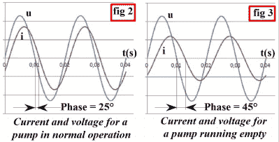

# 相移泵控制？有一个应用程序可以解决这个问题。

> 原文：<https://hackaday.com/2019/07/06/phase-shift-pump-control-theres-an-app-for-that/>

喷泉和游泳池过滤系统中使用的那种泵不容易干涸。因此，当你不在的时候，把这样一个水泵放在一个简单的计时器上运行，会带来一定程度的风险:如果你不在的时候水泵没有水了，你可能会回家看到一堆融化的水。一个可能的解决方案是用一个浮子传感器来检测你要泵的任何东西的水位，但是当你谈论像一个游泳池那么大的东西时，这就变得复杂了。

 为了参加 2019 年 Hackaday 奖，【吕克·布伦】正在研究一种控制器，它可以[通过监测电压和电流之间的相移](https://hackaday.io/project/166092-bluepump)来检测泵何时干涸。对于像泵这样的感性负载，在正常工作情况下，电流应该稍微滞后于交流电压。但是，如果它们彼此之间的相位相差太远，那就是泵处于空载状态的信号，因为没有水来减慢它的速度。

正如[Luc]在项目报告中解释的那样，简单地监控泵的峰值电流是可行的，但是不太可靠。问题是不同的电机有不同的电流消耗，所以除非你校准控制器来保护特定的负载，否则你可能会得到错误的读数。但是电流和电压之间的关系在不同的电机之间应该保持相当一致。

控制器由 Arduino Nano 供电，并使用 ACS712 电流传感器进行相位测量。因为他有能力通过连接在 Arduino 上的继电器来打开和关闭泵，[Luc]决定增加一些其他功能。DS1307 实时时钟的增加意味着泵可以按计划运行，HC-05 蓝牙模块让他可以通过他开发的 Android 应用程序从智能手机监控整个系统。

由于今年 Hackaday 奖的主题是设计 T2 的产品，而不是一次性的产品，评委们将会寻找 Luc 在这里展示的前瞻性思维。由于控制器目前是一个防水外壳内的大量独立模块，该项目的下一步可能是最终完成硬件设计和定制 PCB 的生产。

The [HackadayPrize2019](https://prize.supplyframe.com) is Sponsored by:     