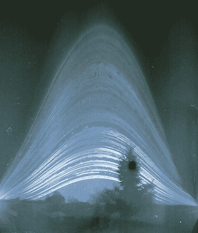

# 数码照相用 Pi Cam 代替针孔和胶片

> 原文：<https://hackaday.com/2020/04/28/pi-cam-replaces-pinhole-and-film-for-digital-solargraphy/>

Solargraph from a one-year exposure on film. [Elekes Andor](https://commons.wikimedia.org/wiki/File:Solargraph_from_Sashegy_-_Budapest,_2014.01.01_-_2014.12.31_(1).jpg "via Wikimedia Commons") / CC BY-SA

你听说过太阳能摄影吗？这个名字告诉了你很多你需要知道的东西，但是用自制针孔相机和一张摄影胶片创建的图像可以在视觉上引人注目，因为它们显示了太阳在几个月内每天穿越天空的累积轨迹。但是如果你不想用胶片呢？太阳能摄影对全世界的数码摄影师来说遥不可及吗？

一点也不，多亏了[这个数字太阳能系统](https://hackaday.io/project/170646-digital-solargraphy-camera)。[volzo]寻找一种方法，使数码相机像基于胶片的太阳能相机一样工作，首先想到在白天拍摄一系列图像，然后将它们平均在一起。他发现这只是从最终图像中平均出了太阳。他的解决方案是在每个时间点拍摄两张照片——一张正确曝光以捕捉场景，另一张则停下来捕捉太阳的位置。所有的前景图像被平均，而停止下降的太阳图像相互叠加，产生太阳穿过天空的轨迹。将两张合成图像相加，你就得到了一张太阳图。

为了自动化这个过程，[volzo]使用了一个树莓 Pi 和一个安装在防风雨 3D 打印盒子中的 Pi-Cam。一顶定制的帽子每隔几分钟就给 Pi 加电，它启动并拍摄两张照片。可悲的是，电池只能维持几天，所以那些长达六个月的曝光还不可能。但是[volzo]已经提供了所有的资源，所以你可以在他的工作基础上随意构建。如果你喜欢在工作中使用 DSLR，[这款蓝牙测距仪](https://hackaday.com/2020/02/21/bluetooth-intervalometer-makes-time-lapses-easy/)可能会有所帮助。