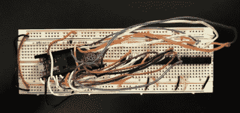

# Pi Pico 模拟 ROM 快速复古黑客

> 原文：<https://hackaday.com/2021/09/02/pi-pico-emulates-rom-for-speedy-retro-hacking/>

如果你曾经在一个从 rom 或 EPROM 加载软件的系统上工作过，你就会知道频繁地修改代码有多麻烦。每次换线时拔出芯片，闪烁一下，然后再插回插座，没人觉得这是个好时机。这就是为什么[【Nick Bild】想出了 PicoROM，一种使用 Raspberry Pi Pico](https://github.com/nickbild/picoROM) 模拟 ROM 芯片的方法。

用 Pi Pico 代替原来的 ROM，更新固件只需要很少的时间，而且不需要你实际断开任何硬件。[Nick]过去曾用 FPGAs 做过类似的工作，但 Pi Pico 的成本低得多，也更容易使用，这使得这个版本特别有吸引力。让它工作的秘密是 Pico 的超频潜力，他说这种特殊的应用已经被推到 400 MHz。

PicoROM on a breadboard.

缺点是，当芯片运行如此之快时，你无法访问 Pico 的板载闪存。为了绕过这一限制，所有代码都被加载到微控制器的 RAM 中。有了健康的 264 KB 内存，这在模拟 32 KB 芯片时不是问题，但是[Nick]说他的方法对于更大的 rom 会很快崩溃。

除了 Pi Pico 本身，[Nick]还使用了三个 74LVC245AN 8 位逻辑电平移位器，这样芯片就可以与他的家酿 6502 计算机的 5 V 逻辑进行对话。PicoROM 将所有东西都连接在一个简单的试验板上，当它以 2 MHz 的频率运行时，为操作系统提供服务没有任何问题。

当然，现代高性能微控制器并不是绝对必要的。在过去，我们已经介绍过可以使用 20 世纪 90 年代的硅片模拟 EPROM 的设备。