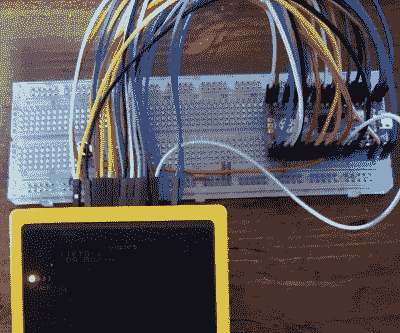

# 皮皮科游戏男孩闪光车获得超薄 RP2040 升级

> 原文：<https://hackaday.com/2021/07/01/pi-pico-game-boy-flash-cart-gets-slim-rp2040-upgrade/>

这个故事开始于几个月前，[约翰·格林发布了他的微微千兆项目](https://github.com/0xen/PICO-GB)。他的代码允许 Raspberry Pi Pico 代替 Game Boy 卡盒，并配有一个简单的文本菜单，让用户在已经烘焙到微控制器固件中的 rom 之间进行选择。这个项目特别值得注意的是，它完全是一个软件解决方案；虽然定制的分线盒是一种方便的临时解决方案，但如果你愿意，你可以将 Pico 的引脚直接永久连接到 Game Boy 的盒连接器上。

PICO-GB running on the full-size Pi Pico

然后在 6 月初，为 Pi Pico [提供动力的 RP2040 芯片开始以单个单位数量](https://hackaday.com/2021/06/01/new-part-day-rp2040-chips-in-single-unit-quantities/)出售。这开启了将 PICO-GB 功能构建到一个足够小的盒子中的可能性，该盒子实际上适合 Game Boy。所以[马丁“HDR”ref Seth]开始创造你现在看到的[光滑墨盒 PCB](https://github.com/HDR/RP2040-Game-Boy-Cartridge)。

RP2040 加入了三个德州仪器 TXB0108 电平转换器，并有一个添加 SPI 闪存芯片的位置。RP2040 支持最大 16 MB 的外部闪存，但鉴于 Game Boy 游戏的大小通常以千字节为单位，这应该不会造成太大的问题。

展望未来，最初的 PICO-GB 文档提到了从 SD 卡加载 rom 等增强功能，以及支持它的更高级游戏的实时时钟等硬件附加功能。我们假设这些概念最终会成为[Martin]PCB 的一部分，但这仍处于早期阶段。

过去，我们已经看到了使用微控制器的 [Game Boy cartridge emulation，但是我们很高兴看到树莓派基金会的定制芯片](https://hackaday.com/2014/12/30/game-boy-cartridge-emulator-uses-stm32/)的[独特功能如何改善最先进的技术](https://hackaday.com/2021/01/20/raspberry-pi-enters-microcontroller-game-with-4-pico/)

【感谢 Itay 的提示。]