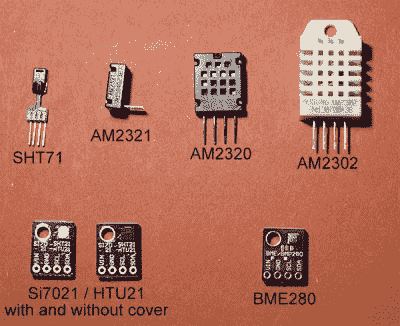
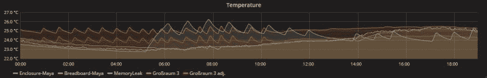
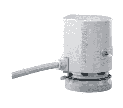
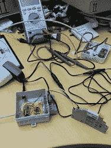

# 为家庭自动化选择合适的传感器

> 原文：<https://hackaday.com/2019/04/16/picking-the-right-sensors-for-home-automation/>

假设您正在启动一个需要测量温度和湿度的项目。这在理论上听起来很容易，但从众多设备中选择一个真正的设备需要挖掘似乎无限的细节和随之而来的权衡。如果这是一个低风险的监控项目，选择第一个想到的传感器可能就足够了。但是当这个项目的目标是在一个对温度敏感的程序员的办公室里控制一个交流系统时，仔细看看所有信息的来源是值得的:传感器。

继续[上一篇文章](https://hackaday.com/2019/03/20/the-joy-of-properly-designed-embedded-systems/)我想用那篇文章中的同一个 [BMaC 项目](https://github.com/MayaPosch/BMaC)来说明即使是几个新手也能想出如何选择从环境传感器到各种执行器的一切，将其集成到一个连贯的系统中，最终实际上做它应该做的事情。

## 受欢迎程度不是一个好的指标

当谈到确定一个人需要哪些组件时，一个主要问题是有许多(在线)文章、论坛帖子和其他评论，这些人使用相同的传感器和致动器，而从来没有真正质疑他们为什么使用这些设备而不是其他设备。DHT11、DHT22 和 AM2302 温度和湿度计传感器就是一个很好的例子。虽然非常受欢迎，每个人和他们的狗都在使用，但它们也有一系列潜在的问题。

这个传感器和其他一些传感器最近在一个综合测试中进行了比较。该测试的结果显示，在六种不同的传感器设备(特别是 DHT22、BME280、SHT71、AM2320、HTU21D 和 Si7021)中，DHT22 的表现最差，六个传感器中有三个在两年的时间里彻底报废。

他们还显示了单个传感器之间的可变性问题，以及缺乏[长期稳定性和可靠性](http://www.kandrsmith.org/RJS/Misc/Hygrometers/calib_dht22.html)。无法预期长期稳定性，自热是一个问题，并且与故障传感器相比，没有可靠的方法来检测强烈的加热或冷却。

另一个问题是，这些传感器使用自己专有的接口和协议。该协议有点类似于达拉斯半导体公司发明的[单总线协议](https://en.wikipedia.org/wiki/1-Wire)，但使用自己的定时系统，没有总线控制附加功能。只有从中文翻译的数据表作为库的基础，人们不得不提出关于包括这些传感器之一的任何系统的可靠性的严重问题。

在 BMaC 项目中，我们最初也从这些 DHT22 传感器开始。它们既便宜又丰富，乍一看似乎还不错。不幸的是，我们的分线板不包括分线板上合适的电阻，所以我们后来发现，湿度测量值偏离了几个百分点。这些传感器，尤其是分线板，体积也很大，很难集成到项目中。

在某个时候，我们遇到了博世的 BME 280 MEMS 传感器。它类似于 BMP180，另一种非常受欢迎的 MEMS 温度和相对湿度传感器。BME280 做得差不多，只是更精确一点，还增加了气压测量。更好的是，这些传感器在一个漂亮的小分线板上，比我们之前一直使用的 DHT22 板贵不了多少。

这些博世传感器都使用 I2C 或 SPI 总线。这意味着人们可以将多个这样的传感器挂接到一条 I2C 总线上，并使用行业标准协议与它们进行通信。这极大地简化了传感器代码，因为它只需读出适当的寄存器，而不是接收位的定时和解释。

简而言之，这些 BME280 传感器是该项目的最佳选择。它们更小、更精确，使用标准接口，易于将多个传感器链接到单个微控制器，并在此过程中获取气压读数。

## 细节决定成败

对于湿度计，自热会导致不准确的结果。测量温度的行为只是使设备本身变热。在最初的 BMaC 项目中，在没有绝对参考传感器的情况下，我们努力确定 DHT22s 和 BME280s 温度计的精度。

有很多论坛和邮件列表帖子，人们注意到他们的 BME280 传感器的测量值比它应该的高两度，或者他们的 DHT22 的测量值完全不正常。不幸的是，我们发现后一个问题是某些分线板的情况，而 BME280 的前一个问题很难确定是真的。

从那时起，包括进行上述湿度计枪战的人在内的人还对 BME280 和 DS18B20 传感器进行了[绝对温度测试](http://www.kandrsmith.org/RJS/Misc/Hygrometers/absolutetemperature.html)，结论是没有明显的自热迹象。在快速和持续测量的情况下，人们可能会引起某种程度的自热，但人们可能会想知道什么样的环境会有如此快速变化的温度，以至于一秒钟的温度更新是必要的。

对于 BMaC 项目，我们使用 30 秒的测量间隔，这对于一般的室温测量来说绰绰有余。即使我们转而使用 BME280 传感器作为空调控制系统的输入，我们也能在空调和温度响应之间获得良好而紧密的反馈环路，如图所示:

蓝色图形(MemoryLeak)是从安装在天花板上的 BME280 传感器报告的温度，该传感器位于一个配有两台空调设备的会议室中，而其他两条曲线(Gro 和 raum 3)来自开放式办公室中一排三台空调设备中间的同一类型传感器设置。最后，在同一个开放式办公室里，我桌子上贴有我名字的传感器读数是基于 DHT22 的设置。

开放式办公室中的传感器设置还控制空调设备的风机盘管装置(FCU ),同时测量同一空间的温度。会议室和普通房间读数之间的差异显示了这两个系统的配置和测量是多么不同。带有壁挂式传感器和主动加热模式的原始交流控制器可快速提升风扇，并在达到目标温度时减速。

相比之下，我安装在天花板上的传感器和控制器采用了一种更渐进的方法，更喜欢以小增量缓慢提高风扇速度，并使用附近 BME280 传感器的温度读数不断进行调整。显然，为了动物的舒适，这种系统不引人注目并且最重要的是准确是很重要的。

## 启动重要业务的时间到了

虽然摆弄温度没什么大不了的，但当你开始操纵隐藏在办公楼天花板上的水阀和其他玩具时，真正的乐趣才开始。改变 FCU 的风扇速度非常容易——使用 0-10 V DC 信号到原始 FCU 控制器板上的集管——控制热水和冷水流量的阀门(如前述前一篇文章中的[所述)需要一些定制硬件。](https://hackaday.com/2019/03/20/the-joy-of-properly-designed-embedded-systems/)

FCU 附近的阀门通常是线性热电致动器类型，由此通过电阻加热来加热阀门内部的材料，以便引起线性运动。这种运动依次打开或关闭阀门。我们遇到的是霍尼韦尔制造的，安装了 24 VAC 版本。这些看起来像这些:

这是高风险的黑客行为。如果错误地使用阀门，让它们开得太久，或者消耗太多的电流，我们很有可能会对某些东西造成不可挽回的损害，甚至更糟:使整栋大楼的空调系统瘫痪。在这种情况下，你会希望自己更加关注一个用于执行器的健壮系统。

 我们最终为空调阀门实施的系统要么通过继电器为整层区域开关使用标准控制信号，要么绕过原来的继电器，在 FCU 的原阀门控制线上使用已经存在的 24 VAC 电源。对于后者，我们使用工业凤凰接触 SPST 继电器，由来自 MCP23008 基于 I2C 的 GPIO 扩展器的达林顿阵列驱动。

该系统的优势在于，它使用了旨在用于工业环境的现成组件。通过确保特别是机械(继电器)部件的额定使用条件(安装在吊顶上方闷热的空间中)，随着时间的推移，故障应该不太可能发生。

## 当一个人有能力学习课程时

随着 BMaC 项目(或当时仍被称为“玩物联网东西”)的开始，我们做的任何事情都没有什么重要的。使用 DHT22 传感器，只是发现它们没有那么好，因此完全没问题。随着项目从仅仅进行测量升级到控制建筑系统的各个部分，很快就可以清楚地看到风险已经急剧上升。

在任何使用传感器和/或致动器的项目中，随着时间的推移，验证传感器和致动器的准确性和可靠性的需求与其中任何一个传感器和致动器出现故障的后果直接相关。Grafana 仪表板上显示不准确的室温测量值令人尴尬，有一台不可靠的咖啡机令人讨厌，有一个不起作用的空调系统会使公司损失数千欧元的生产力，甚至更糟。

这就引出了这篇文章的外卖信息；任何严肃项目最重要的部分是知道失败的代价是什么，以及如何通过选择正确的系统组件来避免失败。