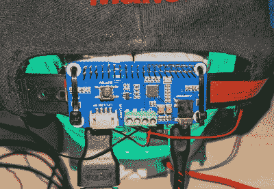

# 皮格拉斯 V2 拥抱新的覆盆子 Pi Zero 2

> 原文：<https://hackaday.com/2021/11/27/piglass-v2-embraces-the-new-raspberry-pi-zero-2/>

嗯，那肯定没花多长时间。距离 Raspberry Pi Zero 2 上市只有大约一个月的时间，我们已经看到人们重新审视旧项目，以获得嵌入式升级的好处，这种升级在相同的外形规格下提供了五倍的计算能力。

以【Matt】一直在做的 PiGlass v2 为例。他最初在 2018 年将 Pi Zero 可穿戴设备组装在一起，尽管它具有许多花哨的功能，如 VuFine+显示屏、5 MP 摄像头和骨传导音频，但最初 Zero 的硬件相当缺乏活力，使其无法发挥真正的潜力。

 但是多亏了新发布的 Pi Zero 2，将四核电源安装到现有设备上就像拔掉几根电缆和更换主板一样简单。随着新 Pi 性能的提高，他能够通过 Kodi 播放多媒体内容，用 RetroPie 模拟经典游戏，甚至将直播视频传输到 YouTube。使用下面视频中的自定义菜单，他只需要一个来自 8BitDo 的现成的蓝牙控制器来控制可穿戴设备的各种功能，而不会被完整的键盘和鼠标所困扰。

虽然新的 Pi Zero 2 可能没有它的兄弟姐妹们强大，但它绝对是一个非常令人兴奋的平台。[高效板提供了与旧 Pi 3](https://hackaday.com/2021/11/01/the-pi-zero-2-w-is-the-most-efficient-pi/) 不相上下的性能，同时仍然很适合像这样的电池供电项目。随着新的 SBC 在未来几个月里落入更多黑客和制造商的手中，我们急切地想知道会发生什么。

 [https://www.youtube.com/embed/8yGQggG_rbY?version=3&rel=1&showsearch=0&showinfo=1&iv_load_policy=1&fs=1&hl=en-US&autohide=2&wmode=transparent](https://www.youtube.com/embed/8yGQggG_rbY?version=3&rel=1&showsearch=0&showinfo=1&iv_load_policy=1&fs=1&hl=en-US&autohide=2&wmode=transparent)

