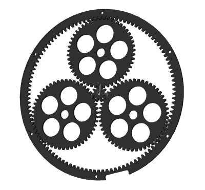

# 在这个装饰时钟中，行星齿轮显示时间

> 原文：<https://hackaday.com/2020/04/10/planetary-gears-tell-time-in-this-ornamental-clock/>

钟表可能是最受制造商欢迎的项目之一。我们看到的大多数设计都是纯电子的，并不涉及通常更复杂的机械部分。Instructables 用户[Looman_projects]不怕为他的[行星齿轮时钟](http://www.instructables.com/id/Planetary-Gear-Clock/)计算齿轮比和齿数。

如图所示，行星齿轮，也称为周转齿轮，由三部分组成:一个中心太阳齿轮，围绕太阳齿轮运动的行星齿轮和一个带有向内齿的外环，将它们固定在一起。这种机制可以追溯到古希腊，但仍被用于汽车变速器，并在 3D 打印中变得非常流行。在他的 instructable [Looman_projects]中有一些有用的链接，包括一个关于行星齿轮组如何工作的[解释视频](https://youtu.be/ARd-Om2VyiE)和一个帮助你计算特定传动比的齿数的[网站](https://woodgears.ca/gear/planetary.html)。同样值得注意的是，他试图用喷水器切割铝制齿轮，可惜失败了，因为零件太小了。让这款钟在视觉上脱颖而出的是表盘和指针采用激光切割木材制成的美丽的装饰性透明设计。尽管有机械变速箱，但驱动机制基于无处不在的数字电子产品也就不足为奇了，包括 Arduino Nano、DS3231 RTC 模块和步进电机。为了避免布线混乱，[Looman_projects]设计了一种定制的 PCB，将所有电子设备相互连接起来，并表示他甚至为有兴趣重建时钟的人留下了一些备用 PCB。

其实这并不是我们见过的第一个[激光切割行星齿轮钟](https://hackaday.com/2015/03/01/laser-cut-clock-uses-planetary-gear/)。如果你想知道行星齿轮箱的优势，你可能想看看 [3D 打印版本是如何举起铁砧](https://hackaday.com/2017/07/27/3d-printed-gearbox-lifts-an-anvil-with-ease/)。

 [https://www.youtube.com/embed/1x9VY0oM8-k?version=3&rel=1&showsearch=0&showinfo=1&iv_load_policy=1&fs=1&hl=en-US&autohide=2&wmode=transparent](https://www.youtube.com/embed/1x9VY0oM8-k?version=3&rel=1&showsearch=0&showinfo=1&iv_load_policy=1&fs=1&hl=en-US&autohide=2&wmode=transparent)

