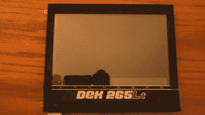

# 在工业 EL 显示器上玩 NES 游戏

> 原文：<https://hackaday.com/2019/05/22/playing-nes-games-on-an-industrial-el-display/>

现代游戏机很有趣，但复古装备也有一定的魅力，让黑客们娱乐至今。最初的 NES 是一个特别成熟的项目，是那个时代最受欢迎的游戏机之一。[kevtris]就是这样一个任天堂黑客，[并决定让 NES 游戏在一个老式的电致发光显示器上运行(Youtube 视频，嵌入下文)](https://www.youtube.com/watch?v=e_CpiME4IGY)。

The display in this project was originally used in an industrial pick-and-place machine.

[kevtris]没有使用原始的 NES，而是选择了 NT Mini，这是一个基于 FPGA 的他自己设计的克隆体。他拿起一个 EL640.480-AA1 屏幕，之前是从 DEK 265LT 取放机上取下的，然后找到一份数据表，开始工作。随着文档概述了所需的视频输入规格，这是一个简单的事情，搅起一些 Verilog 和适配器电缆，让事情的工作。

Mario、Kirby 和朋友们现在可以四处奔跑，在红/绿 EL 显示屏的 9 种颜色中看起来光彩照人。[kevtris]注意到屏幕在快速移动时表现良好，并估计刷新率在 60Hz 左右。对于那些在家玩的人来说，这种屏幕在网上可以买到，尽管它们并不便宜。

我们以前看过[kevtris]的作品，[他的 SNES chiptune 播放器给人印象特别深刻](https://hackaday.com/2017/08/30/portable-snes-chiptune-player/)。休息后的视频。

【感谢莫里斯的提示！]

 [https://www.youtube.com/embed/e_CpiME4IGY?version=3&rel=1&showsearch=0&showinfo=1&iv_load_policy=1&fs=1&hl=en-US&autohide=2&wmode=transparent](https://www.youtube.com/embed/e_CpiME4IGY?version=3&rel=1&showsearch=0&showinfo=1&iv_load_policy=1&fs=1&hl=en-US&autohide=2&wmode=transparent)

