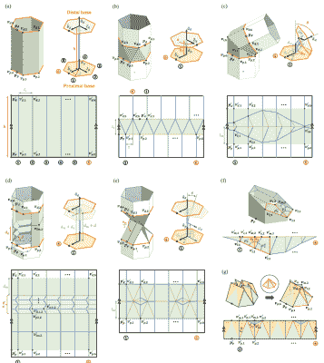

# 用管状折纸来加强你的手艺

> 原文：<https://hackaday.com/2022/12/01/ply-your-craft-with-tubular-origami/>

宾夕法尼亚大学的研究人员刚刚发表了一篇关于创造模块化管状折纸机器的论文，他们称之为[“kine gami”](https://repository.upenn.edu/ese_papers/884/)，这是“运动学”和“折纸”的组合。

他们工作背后的想法是创建单独的模块和关节机构，然后可以链接在一起，创建一个更大的“串行”机器人。他们提出的一些示例关节是允许线性运动的“棱柱”关节和允许旋转运动的“回转”关节。这一过程中更令人兴奋的一个方面是关节机构是折纸状结构，它可以由单片扁平材料折叠并粘合在一起制成模块。特别令人感兴趣的是，折纸状折叠的折痕图案可以被激光切割到一种材料中，例如纸板或薄丙烯酸树脂，其可以被用作创建最终结构的指南。支撑结构(如管道或接头)的折痕模式可以从预先格式化的模式中获取或定制，因此这种方法对于爱好者来说非常容易获得，并且可以为快速项目原型制作提供丰富的新方法。

研究人员继续讨论如何从关节和链接的规范(从[“dena vit-harten Berg”](https://en.wikipedia.org/wiki/Denavit%E2%80%93Hartenberg_parameters)规范)到在尊重曲率约束的情况下将关节连接在一起(通过[“杜宾斯路径”](https://en.wikipedia.org/wiki/Dubins_path))来创建模块的组合。他们的[论文](https://repository.upenn.edu/cgi/viewcontent.cgi?article=1945&context=ese_papers)提供了具体的细节以及可用的随附[源文件](https://codeocean.com/capsule/7709162/tree/v1)。折纸黑客是我们最喜欢的主题，我们已经发表了关于折纸在[医疗技术](https://hackaday.com/2022/03/09/bringing-the-art-of-origami-and-kirigami-to-robotics-and-medical-technology/)创造[充气致动器](https://hackaday.com/2022/07/24/complex-movements-from-simple-inflatables-thanks-to-physics/)中的应用的文章。

休息后的视频！

 [https://www.youtube.com/embed/IT58JeMoAr0?version=3&rel=1&showsearch=0&showinfo=1&iv_load_policy=1&fs=1&hl=en-US&autohide=2&wmode=transparent](https://www.youtube.com/embed/IT58JeMoAr0?version=3&rel=1&showsearch=0&showinfo=1&iv_load_policy=1&fs=1&hl=en-US&autohide=2&wmode=transparent)

