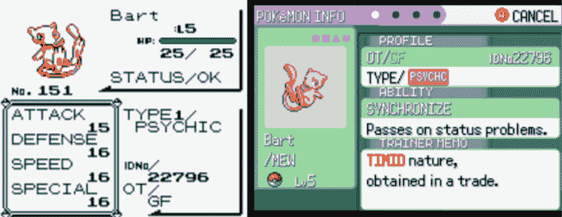

# 口袋妖怪时间机器让你真的抓住他们所有人

> 原文：<https://hackaday.com/2021/08/25/pokemon-time-machine-lets-you-really-catch-em-all/>

自 1996 年以来，口袋妖怪系列游戏已经经历了八代，大致相当于任天堂掌上游戏系统的谱系。虽然“口袋妖怪”的名单一直在稳步更新，但玩家可以选择将旧游戏中捕获的口袋妖怪带入新版本。但这种能力一直存在差距。由于硬件差异，Game Boy 和 Game Boy Color 代游戏在物理上无法与为 Game Boy Advance 发布的标题进行通信。

但很快，情况可能不再如此。[【Selim】正在努力开发 *Lanette 的 Poke Transporter*](https://lanette.myles-selim.us/) ，这是一个将口袋妖怪从第一代和第二代游戏带到第三代 GBA 游戏的硬件和软件解决方案。一旦它们被加载到那里，玩家可以通过官方手段将这些生物一路移动到当代口袋妖怪游戏中。

The first Pokemon to make the generational leap.

该项目于 2020 年 7 月开始，Selim 首先关注将早期口袋妖怪引入新游戏的物流挑战。因为不同代之间有如此多的变化，所以在转移过程中需要进行许多健全性检查。例如，生物能够学习的动作和技术在这个系列的早期作品中不一定是一致的。但经过大约一年的努力，软件方面在仿真游戏上工作可靠，是时候开始考虑硬件了。

最终，[Selim]希望创造一种物理设备，玩家可以将他们的口袋妖怪墨盒插入其中，并触发自动传输。代码已经能够读写盒式磁带，并且已经移植到 Arduino 上，所以它不需要计算机来运行。一些原型多氯联苯已经被创造出来，除了不可避免的损坏，它们看起来很实用。放眼望去，仍然有面包板和跳线，但这是生产专用口袋妖怪“时间机器”的第一步，可以将它们从 20 世纪 90 年代末运送到今天。

随着[stacksmashing]最近表明 [Raspberry Pi Pico 足够快，可以模仿 Game Boy 的“Link Cable”配件](https://hackaday.com/2021/05/10/tetris-for-game-boy-gets-online-multiplayer/)，以及人们对通过电线交易口袋妖怪的[协议相当了解](https://hackaday.com/2014/01/02/spoofing-pokemon-trades/)，我们想知道是否有一天这项技术不能在链接的手持设备之间实时进行。如果你能让两份*俄罗斯方块*通过互联网相互连接，看起来你有足够的时间来摆弄一个游戏迷的数据。