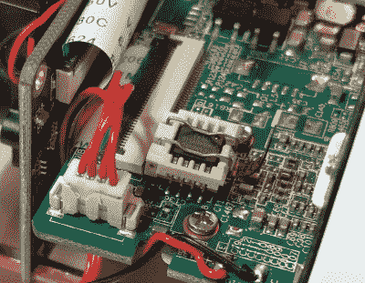

# 在 Linux 安全摄像头里探头探脑

> 原文：<https://hackaday.com/2020/05/20/poking-around-inside-of-a-linux-security-camera/>

[对 Linux 驱动的 Reolink B800 IP 摄像机](https://www.thirtythreeforty.net/posts/2020/05/hacking-reolink-cameras-for-fun-and-profit/)的深入研究始于其制造商违背的承诺。当[George Hilliard]购买了一套包括六个摄像头和一个录像机的工具时，该网站称他们能够输出标准的 RTSP 视频。但是当他收到货物后，当然也是在他的退货窗口关闭后，网站更新说这些相机只能和附带的录像机一起使用*。*

 【乔治】将此视为挑战，开始工作。当他拆下相机的 SPI 闪存芯片并用一个插座取而代之时，他迎来了第一次重大突破。这使得他可以在修改固件时轻松地将芯片从设备中取出来进行读取和刷新。在将交叉编译版本的`busybox`、`gdb`和`strace`添加到提取的固件中后，他将它打包备份并刷新回硬件。

如果你认为这就是故事的结局，它不是。事实上，这仅仅是个开始。虽然获得相机操作系统的根级访问权限可能会允许[George]转储它正在运行的所有专有软件，并用开放的替代软件来替换，但他决定采取不同的方法。

他没有更换相机的原始软件，而是使用他新授予的 root 权限来分析它并弄清楚它是如何工作的。这使得他能够嗅出软件中内置的一些非常可疑的“加密”例程，并最终在 Rust 中编写自己的服务器端，最终允许他在自己的服务器上使用摄像头……尽管这比他预想的要多做一点工作。

像这样的项目是对现实世界逆向工程的奇妙观察，并提醒人们有时实现你的最终目标意味着绕远路。即使你不打算购买被黑的安全摄像头，毫无疑问，阅读[乔治]准备的详细报道会让你学到一些东西。但是当然，我们对一个在他的名片上运行 Linux 的人的期望丝毫不亚于[。](https://hackaday.com/2019/12/24/now-even-your-business-card-can-run-linux/)