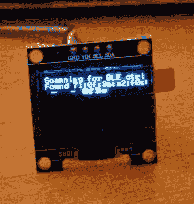

# 探索蓝牙的广阔世界

> 原文：<https://hackaday.com/2020/01/30/poking-around-the-wide-world-of-bluetooth/>

蓝牙是一项有着非常有趣历史的技术。当它在 20 世纪 90 年代末首次出现时，它承诺取代当时塞在每张桌子后面的杂乱的电线。不幸的是，早期蓝牙的功能并不像宣传的那样好，它从未真正起飞。直到十多年后智能手机的兴起，蓝牙才真正开始有意义，现在蓝牙已经有了几个更先进的版本。

 正如【拉里·班克】在最近的一篇博客中解释的那样，这意味着如果你想真正理解蓝牙黑客，还有[很多东西要学。例如，20 世纪 90 年代和 21 世纪初使用的蓝牙版本实际上是与大多数现代设备使用的完全不同的协议。但是现在被称为“经典”的原始协议仍然被支持和使用。](https://bitbanksoftware.blogspot.com/2020/01/my-ble-adventures.html)

这意味着要真正理解蓝牙的工作原理，你需要了解不同的版本以及与之相关的所有工具和技巧。为此，[Larry]做了大量的工作来分解蓝牙的主要版本和你可能会发现自己正在使用的工具。这包括微控制器，如 ESP32 或 Arduino Nano 33 BLE。

但是这个帖子不仅仅是理论。[Larry]还回顾了他的一些利用蓝牙的真实项目，例如让便携式打印机与他的 Arduino 一起工作，或者弄清楚如何为自己的目的使用那些微型手机游戏控制器。即使你没有这些相同的设备，使用的方法和学到的经验也很有可能适用于你看中的任何蓝牙设备。

读者可能会从我们以前对他的功绩的报道中回忆起[Larry]，例如他努力[提高 SSD1306 有机发光二极管显示器](https://hackaday.com/2018/05/08/push-it-to-the-limit-ssd1306-at-150-fps/)的帧速率，或者他为 SMART Response XE 开发的[无线引导程序。每当我们看到他的名字出现在提示行，我们知道一个迷人的硬件深潜是不远了。](https://hackaday.com/2018/09/08/smart-response-xe-gets-wireless-bootloader/)