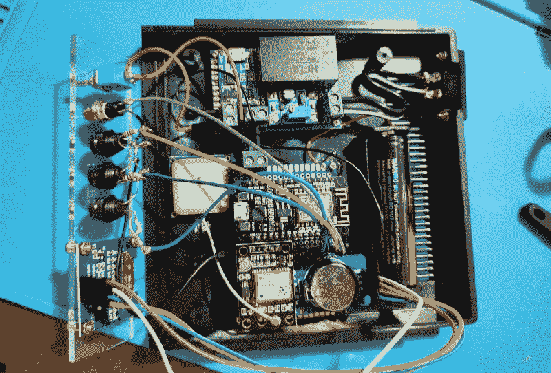

# 由 ESP8266 供电的便携式 GPS 时间服务器

> 原文：<https://hackaday.com/2021/07/25/portable-gps-time-server-powered-by-the-esp8266/>

大多数 Hackaday 的读者都熟悉网络时间服务器的概念；一个神奇的盒子坐落在某个遥远的数据中心，运行网络时间协议(NTP)，允许我们方便地同步我们的计算机和小工具中的时钟。特别热心的时钟观察者实际上可以装配自己的 NTP 服务器供个人使用，如果你是一个像[克里斯蒂亚诺·蒙泰罗]这样的真正的时间迷，[你可能会对他最近组装的便携式 GPS 控制的时间服务器感兴趣](https://www.linkedin.com/pulse/iot-maker-tale-stratum-1-time-server-built-from-scratch-monteiro/)。

 该产品的核心是一个 NEO-6M GPS 模块，它具有一个专用的每秒脉冲(PPS)引脚。ESP8266 将来自 GPS 消息和 PPS 信号的时间戳结合起来，使其自身与轨道卫星上的原子钟同步。为了防止系统在没有锁定 GPS 信号的情况下过于不同步，[Cristiano]使用了 DS3231 I2C 实时时钟模块，该模块具有高精度温度补偿晶体振荡器(TCXO)。

这些组件，加上项目的 GitHub 库中提供的[开源代码，为您提供了一个极其精确的 Stratum 1 NTP 服务器，可以通过 WiFi 响应客户端请求。但是为了进一步发展这个想法，[克里斯蒂亚诺]增加了一个有机发光二极管和一些 LED 来提供反馈，并将整个东西与 18650 电池，TP4056 充电模块和 DC-DC 降压转换器一起放在一个漂亮的外壳中。结果是一个完全无线的时间服务器，可以部署在任何地方，作为一名业余无线电操作员，他计划在现场使用。](https://github.com/Montecri/GPSTimeServer)

无论您是带着它上路还是永久安装，这个项目都是了解 NTP 和 GPS 接收的绝佳方式。这也是一个开始试验这项技术的好时机(没有双关语)，因为已经有一些抱怨说[地面无线电时间信号可能在不久的将来](https://hackaday.com/2018/08/20/what-will-you-do-if-wwvb-goes-silent/)变暗。