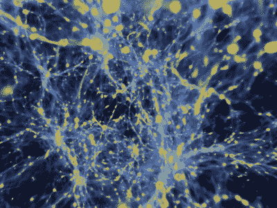
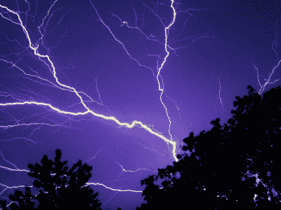

# 发现可能的第五种自然力量

> 原文：<https://hackaday.com/2019/12/24/possible-fifth-force-of-nature-found/>

多年来，人类提出了四种力量，可以用来描述物理世界中的每一种相互作用。分别是引力、电磁力、导致粒子衰变的弱核力、将夸克束缚成原子的强核力。总之，这些已经成为粒子物理学的标准模型。但是暗物质的存在让这个模型显得不完整。肯定有另一种力量可以解释它的存在和它黑暗的原因。

Image via [Business Insider](https://www.businessinsider.com/physicists-discovered-new-fifth-force-of-nature-dark-matter-problem-2019-11)

由 Attila Krasznahorkay 教授领导的 Atomki 核研究所的匈牙利科学家认为，他们发现了第五种自然力的证据。在监测一个受激氦原子的衰变时，他们观察到它发光，这并不罕见。不同寻常的是，粒子以 115 度的精确角度分裂，就好像它们被一种无形的力量撞离了轨道。

科学家们将这种粒子命名为 X17，因为他们计算出它的质量为 17 兆电子伏特(MeV)。一电子伏特描述了单个电子从零伏特移动到一伏特电势时获得的动能，因此兆电子伏特等于电子从零伏特移动到一百万伏特时获得的能量。

## 前四个是什么来着？

让我们从简单的开始，重力。它赋予物体重量，并使物体或多或少地粘在地球上的适当位置。虽然重力是一种相对较弱的力，但它在大范围内占据主导地位，并将整个星系维系在一起。重力帮助我们工作*和*享受乐趣。如果没有重力，就不会有水塔、水力发电厂或过山车。

Lightning via [Wikimedia Commons](https://commons.wikimedia.org/wiki/File:Lightning.0257.jpg)

电磁力是在人类尺度上占主导地位的双头兽。几乎我们的一切和所做的一切都是由这种力量支撑的，这种力量就像一碗飘渺的汤一样围绕着我们。电和磁被认为是一种双重力量，因为它们的工作原理相同——异性相吸，同性相斥。

这种力量将原子结合在一起，使电子学成为可能。它也对可见光本身负责。每个基本力都有一个载体粒子，对于电磁来说，这个粒子就是光子。我们所认为的可见光是光子携带电子和质子之间的静电力的结果。

弱核力和强核力不那么容易掌握，因为它们在亚原子水平上运行。弱核力是β衰变的原因，其中一个中子可以变成一个质子加一个电子和反中微子，这是一种放射性衰变。弱相互作用解释了粒子如何通过改变它们内部的夸克来改变。

强核力是自然界最强的力，但它只在原子尺度上占主导地位。想象一个有多个质子的原子核。所有这些质子都带正电，那么它们为什么不互相排斥，把原子核撕裂呢？强核力大约比电磁力强 130 倍，所以当质子足够靠近时，它将占主导地位。强大的核力把原子核和核子结合在一起。

## 变革的力量

怀疑第五种力量已经有一段时间了。Atomki 的研究人员在 2015 年研究铍-8 同位素衰变时发出的光时观察到了类似的效应。当它衰变时，组成它的电子和正电子会以另一个奇怪的角度互相排斥——正好是 140 度。他们称之为“恐质子”力，即害怕质子的力。世界各地的实验室多次试图证明这一发现是侥幸还是错误，但他们都得出与 Atomki 相同的结果。

Attila Krasznahorkay 教授和他的团队在 10 月下旬发表了他们的观察结果，尽管该论文还有待同行评议。现在，Atomki 的计划是观察其他原子的衰变。如果他们能找到第三个表现出这种奇怪行为的原子，我们可能不得不将标准模型带回绘图板，以适应这种发展。

那么，如果科学断定 X17 粒子是第五种自然力的证据，会发生什么呢？我们真的不确定。它可能为暗物质提供线索，也可能让我们更接近统一场论。我们处在已知科学的边缘，所以请在评论中自由地胡乱猜测。

主图像通过[索引](https://index.hu/english/2019/11/27/fifth_fundamental_force_physics_new_particle_hungary_atomki_debrecen/)