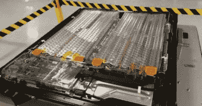
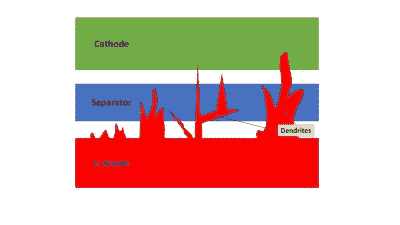
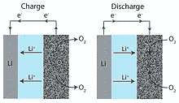
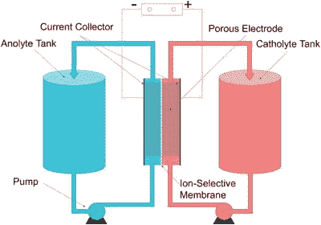

# 电池霸主地位的潜在竞争者

> 原文：<https://hackaday.com/2020/09/01/potential-contenders-for-battery-supremacy/>

锂离子电池是一项革命性的技术。它们的高能量和功率密度使电动汽车成为现实，实现了可再生能源的电网存储，并将强大的计算机放在手掌中。然而，如果有一件事人类是众所周知的，它总是想要更多。

终极电池技术头衔的潜在竞争者已经出现，但将锂离子从树顶上赶下来需要一个重大的转变。

## 占主导地位是有原因的

在 20 世纪 70 年代的重大能源危机期间，在埃克森公司工作的 Stanley Whittingham 首次开发出锂离子电池，当时他正寻求多元化发展，摆脱石油。多年来，这项技术得到了进一步发展，约翰·古德诺(如果我们听说过一个超级黑客的名字的话)和阿基拉·吉野通过改进阴极和阳极材料提高了性能。商业化首先是由 Keizaburo Tozawa 实现的，他在索尼[工作，为该公司的摄像机系列](https://www.sony.net/SonyInfo/CorporateInfo/History/SonyHistory/2-13.html#block3)开发更好的电池。

Many automotive battery packs, such as this Tesla unit, consist of thousands of cylindrical lithium-ion batteries not dissimilar from those commonly used in laptops.

锂离子充电电池具有便携式电源的理想属性，具有高能量密度和高功率密度，这意味着它可以储存大量能量，并在需要大量电流的应用中快速释放能量。低重量和高功率输出改变了游戏规则——尺寸和重量很重要的技术，比如四轴无人机和功能强大的智能手机，对于更老、更重的电池技术来说不实用。

从那以后，全世界都爱上了锂电池。不同的化学成分比比皆是，优化电池以获得更多的充电周期、更高的功率输出或更低的成本。随着便携式消费电子产品时代的到来和电动汽车革命几乎完全依靠可充电锂电池技术，说产量近年来飙升有点轻描淡写。

然而，挑战依然存在。与汽油汽车相比，电动汽车的行驶里程仍然有限，充电时间进一步阻碍了这个问题的解决。近年来取得了巨大的收益，但汽车制造商继续努力提高性能，以此作为竞争优势。此外，虽然价格在过去十年中急剧下降，锂电池仍然不便宜。加剧这种情况的是对稀缺或难以找到的矿物的依赖。钴尤其如此，[导致一些制造商探索替代的锂离子化学物质](https://electrek.co/2020/06/16/tesla-secures-cobalt-deal-controversial-material/#:~:text=Tesla%20has%20secured%20a%20new,out%20the%20controversial%20battery%20material.&text=%E2%80%9CTesla%20will%20buy%20cobalt%20from,and%20the%20Swiss%20mining%20group.)，我们开始看到从等式中完全去除钴的成功。

替代技术仍有挑战锂电池行业霸主地位的空间。任何竞争者都需要很高的能量密度和功率密度，以及持续数千个充电周期的能力。此外，低成本、易于制造、不易发生灾难性故障都是电池研究人员努力达到的目标。

## 在伟大的风口浪尖上？

从实验室到工厂的道路是漫长的，许多令人兴奋的项目在达到商业销售之前很久就会遇到棘手的工程问题。突破正是困难问题突然得到解决的时候，所以让我们来看看什么有可能成为伟大:

### 金属锂为固态，安全性更好

Dendrite formation has long prevented the use of lithium metal anodes in Li-Ion batteries. Researchers believe solid state electrolytes may be the key to stopping dendrite formation, thus allowing the use of the anode material to create higher capacity batteries.

锂离子电池使用各种化学成分的液体电解质来调整特定应用的性能特征。然而，用固态电解质取代这种液体是一个热门的研究课题，因为它有望比当前的电池获得多种收益。

许多人认为固态电解质是一种解决方案，可以在电池中使用锂金属阳极，取代当前大多数应用中的石墨。典型地，由于与液体电解质的化学反应引起的枝晶生长，锂金属是不稳定的阳极材料。如果固态电解质解决了这个问题，电池可以使用性能更好的锂金属阳极材料。这将大大提高能量密度，比传统的锂离子电池高 2.5 倍。

液态电解质也是锂离子电池固有的许多危险的罪魁祸首，当电池经历热失控状态时，它变得高度易燃，甚至具有爆炸性。[固态电池也可以解决这个问题](https://www.theverge.com/2018/8/13/17675376/battery-safety-lithium-ion-solid-state-electrolyte-analysis)，与传统的液体电解质相比，它的可燃性更低。

固态电池技术的全面普及仍然存在障碍。[室温下的导电性问题继续阻碍该技术的发展](http://www.ehcar.net/library/rapport/rapport206.pdf)。制造挑战也存在，许多设计需要使用真空沉积技术。不管怎样，许多公司正在向固态电池研究投入大量资金，[特别是三星正在努力开发这项技术。](https://www.whichcar.com.au/car-news/samsung-solid-state-battery-breakthrough)

### 锂空气正在追逐汽油的能量密度

The charge and discharge cycles of a lithium-air battery. Relying on atmospheric oxygen gives the battery a better power-to-weight ratio, but atmospheric contaminants can cause problems.

锂空气电池的工作原理是利用大气中的氧气作为反应物。氧通过碳阴极向锂提供电子。理论上，这种电池的比能量可以达到 11，680 Wh/kg ，接近汽油的 13，000 Wh/kg，远远超过当代的电池技术。排除氧气的质量，单位质量的能量密度比锂离子高 10 倍，这意味着该技术将是增加电动汽车里程的理想选择。

锂空气电池在成功商业化之前面临着诸多挑战。化学稳定性是早期努力的一个问题。阴极材料的进一步发展不断取得成果，但实验室测试的最佳结果是电池实际上只能使用两个月。充电效率也很低，充电过程中只有 65%的能量可用。此外，对气态氧作为反应物的需求带来了进一步的问题。虽然实验室测试可以使用纯氧，但大气中含有二氧化碳、水蒸气和其他可能损坏电池的污染物。这些需要在实际设计中过滤掉。

### 液流电池

The basic operation of a typical flow battery. [Membraneless types are possible](https://www.sciencedirect.com/science/article/pii/S0013468618303451#:~:text=Membraneless%20redox%20flow%20batteries%20reported,cyclability%20due%20to%20reactant%20crossover.&text=The%20battery%20is%20based%20on,and%20columbic%20efficiency%20during%20cycling.), instead using laminar flow to ensure the two liquids touch but don’t excessively mix.

液流电池是一个涉及两种液体的概念，这两种液体被泵送通过一层膜，在这个过程中交换离子并发电——你可能记得几周前读过 [Kristina Panos 关于液态空气储能的文章](https://hackaday.com/2020/07/24/liquid-air-energy-storage-a-power-grid-battery-using-regular-old-ambient-air/),该技术正在考虑用于电网储能。

由于液流电池依赖于以液体形式储存的电荷，因此只需为反应物建造更大的容器，就可以制造出更大的电池。通过简单地更换电解液，电池可以快速“充电”,或者，它可以像传统的可充电电池一样进行电再生。[易于扩展使该技术对电网存储有吸引力](https://www.pv-magazine.com/2020/04/29/a-redox-flow-battery-for-grid-scale-solar-plus-storage/)，而能够快速为电池“加油”的潜力将解决电动汽车快速充电的问题。

尽管有这些好处，液流电池也有一些缺点，这些缺点阻碍了它们的广泛应用。储存和泵送液体在机械上比传统电池复杂得多，传统电池通常可以被视为固体物质，可能只需要偶尔冷却一下。这种复杂性和额外的设备降低了功率密度，使得液流电池在运输应用中不太实用。相反，大多数研究集中于家庭和电网级应用的储能。

## 结论

我们可能还需要一段时间才能在大多数设备中看到电池技术的重大变化。仍然依赖锂化学物质的固态电池可能会成为打破锂离子在交通领域主导地位的主要竞争者，并有可能在笔记本电脑和智能手机等设备中紧随其后。锂空气电池和液流电池在实现可行性之前还有更多障碍需要克服。

然而，由于汽车行业的需求，世界各地的学术界和工业界仍在继续开发现有的锂离子技术。随着容量和性能的逐年提高，我们可能会继续看到传统的锂离子电池在未来相当长的一段时间内仍然是首选电池。