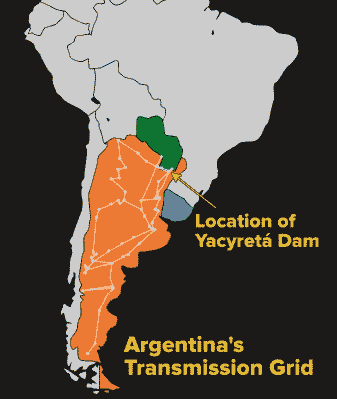

# 导致 4800 万人陷入停电的南美停电

> 原文：<https://hackaday.com/2019/07/22/power-outages-irl/>

上个月南美洲的大规模停电让阿根廷、乌拉圭和巴拉圭的大部分地区陷入黑暗，也可能影响到智利和巴西的一小部分地区。据估计，4800 万人受到影响，截至本文撰写之时，仍没有官方解释如此大规模的停电是如何发生的。

尽管任何电网都几乎肯定会出现某种形式的停电，无论是天气事件、电线和设备的意外损坏、闪电还是设备故障，每个电网最终都会不时出现小规模停电。然而，这一次的范围比它应该有的要大得多，但是对于如此复杂的系统来说，并不是完全不可能的。

6 月 17 日的初步报道列举了模糊的、难以描述的可能原因，但似乎集中在连接人口中心和位于阿根廷和巴拉圭边境的 [Yacyretá Dam](https://www.google.com/maps/place/Yacyret%C3%A1+Dam/@-27.6068742,-57.1642945,9z/data=!4m5!3m4!1s0x945745f6636db81d:0xaa5b034260d26c70!8m2!3d-27.4826809!4d-56.7385743) 水电站的输电线路，以及电网本身的一些持续问题上。输电线路系统的问题导致这个发电设施与电网的其余部分分离，这似乎已经级联成大规模的电力故障。一个积极的消息是，电力在不到一天的时间里恢复了，这至少表明停电的原因不是电网的物理损坏。(大概主要的物理损坏需要更长的时间来修复。)官员们还淡化了网络攻击的可能性，这与停电持续的时间很短是一致的，尽管并非完全没有可能。

从技术角度来看，这一事件也非常有趣。一旦我们排除了物理损坏和网络攻击，剩下的就是电网的大部分自动保护系统的彻底失败。这种自动化可能是一种好的力量，在大多数情况下，电网中断可以快速恢复，但如果自动化没有得到很好的理解、实现或维护，它也可能是一个弱点。有必要对一些保护装置和策略进行更深入的研究，这将使我们对这个问题和电网问题有更深入的了解。休息之后，请和我一起看看这个系统中涉及的一些电网设备。

## 电网中工作的保护装置

首先，有必要深入研究一下大型电网上使用的一些保护装置。当输电线路发生重大故障时，它会被一种称为继电器的传感设备检测到，这种设备通常会在电力系统基频的几个周期内自动断开大型断路器。快速断开故障有助于限制或防止对变压器或发电机等主要设备的损坏。虽然这些继电器的功能与汽车或电子项目中使用的继电器类似，但它们也可以触发电流以外的其他东西。过流继电器当然很常见，但也有过压继电器、欠压继电器、频率继电器，它们可以检测电网不同部分的过频、欠频或不匹配频率，以及各种其他类型的继电器。对于这些继电器中的每一个也有时间规范，因此较小的故障通常比较大的故障需要更长的时间来使主断路器跳闸。老式继电器本质上是机电式的，通常是分立的单元(即过电流继电器和频率继电器一起工作，但它们是功能独立的单元)。较新的系统使用计算机将这些功能简化为单个单元[，就像 SEL](https://selinc.com/products/?Protective%20Relays.Substation%20Protection) 的这个样本，这家公司以其强大的数字继电器而闻名。

实际上，电网上的每个系统都有这些保护继电器，要确保它们协调工作会变得很困难。例如，发电站中的过电流继电器通常应该被设置为比下游变电站中的电路上的过电流继电器更高的跳闸设置，使得如果输电线路上发生故障(例如，由于雷击),则只有变电站继电器使电路离线跳闸，而不是发电机的继电器由于根本不在发电设施中的故障而使整个发电设施离线跳闸。像这样的问题被称为“协调”问题，必须在每一级得到解决，以防止令人讨厌的跳闸和停电，并在其他部分出现问题时保持电网的部分供电。

## 停电期间可能发生的情况

有了这样的背景，我们可以从《时代》杂志的一篇更详细的文章中得到一些帮助，来看看这次大停电的一些细节。这篇文章报告说，存在某种频率问题，这可能表明一个频率敏感继电器在不应该工作的时候工作，或者在应该工作的时候没有工作，或者没有与其他频率继电器适当协调。这可能导致电网的一部分停止运行，而这是稳定运行所必需的。在电网上保持适当的频率尤其困难。位于数百或数千英里之外的发电机必须在完全相同的位置以完全相同的速度旋转，以避免对电网本身造成有害的振荡。让大型发电机上线需要发电机本身与电网频率同步，在这个过程中出现错误是不可原谅的。

另一方面，另一份关于该事件的[报告](https://www.infobae.com/sociedad/2019/06/16/masivo-apagon-a-nivel-pais-capital-federal-buenos-aires-y-varias-provincia-estan-sin-luz/) ( [谷歌翻译自西班牙语](https://translate.google.com/translate?sl=es&tl=en&u=https%3A%2F%2Fwww.infobae.com%2Fsociedad%2F2019%2F06%2F16%2Fmasivo-apagon-a-nivel-pais-capital-federal-buenos-aires-y-varias-provincia-estan-sin-luz%2F))声称，高湿度可能导致传输系统上的一个绝缘体出现故障，电力能够跟随绝缘体周围的水分导致过电流故障。切断这么多的发电能力可能会导致电网欠压或频率故障，引发级联。然而，不管最初的原因是什么，级联反应总是应该被计划好，并在失控之前停止。

《纽约时报》的文章还报道说，暴风雨对该地区的输电线路造成了一些现有的破坏，虽然这不是大规模停电的直接原因，但也可能是一个促成因素。电网特别容易受到级联故障的影响，这是一种正反馈回路，一个小故障导致更多故障，进而导致更多故障。在这种情况下，受损的输电线路可能已经停止运行，给该地区剩余的输电线路带来更多的负荷。如果发生过电流故障，就会使另一条线路停止工作。如果越来越多的电力开始流向越来越少的线路，结果可能是整个电网离线。2003 年美国和加拿大的东北大停电就属于这种情况。

当然也可能是所有这些问题。这一频率可能是级联故障的开始，已经不堪重负的受损输电线路系统进一步加剧了故障。

## 快速恢复是好迹象

无论原因是什么，令人鼓舞的是，电网运营商能够在不到一天的时间内恢复几乎所有客户的供电。在飓风和地震等重大破坏导致的停电中，恢复工作可能需要数周时间，或者在玛丽亚飓风后波多黎各等特别糟糕的情况下，修复可能会持续数月。

> 能源政府秘书处报告，今天 07:07 时，阿根廷互联系统(SADI)崩溃，导致全国大规模停电，乌拉圭也受到影响。原因正在调查中，尚未确定。在库约、NOA 和科马休地区已经开始恢复，系统的其余部分正在开放，以继续全面恢复，估计需要几个小时。

从电力分配公司 Edesur 在事故期间发布的[更新中，您可以看到他们立即发现了问题，并迅速隔离和消除了问题，以确保在恢复供电后不久不会出现更多问题。然而，由于网格的复杂性，这样的风险永远无法从系统中完全消除。](https://www.edesur.com.ar/novedades/apagon-masivo-en-argentina/)[由于多种原因，大规模停电仍在继续发生](https://hackaday.com/2017/04/03/when-the-grid-goes-dark/)，从许多方面来看，这是恢复工作的最佳情况。阿根廷及其周边地区有许多水力发电站具备[黑启动功能](https://en.wikipedia.org/wiki/Black_start)——能够在完全关闭的情况下重启，无需外部电源——反过来为其他发电站提供电力，使电网快速可靠地上线。在这种情况下，跨国家线路的合作也令人印象深刻，因为五个国家能够每天一起可靠地运行电网，促进跨境运输和销售电力，并在像这样的停电后一起进行恢复。

## 这可能发生在任何地方

最后，重要的是要认识到南美的电网与世界其他地区的电网并没有根本的不同。像这样的中断可能发生在任何地方，尤其是当设备老化或维护不善时。例如，美国土木工程师协会(American Society of Civil Engineers)不时对基础设施的各个部分进行评级，截至 2017 年[美国电网的评级为 D+级](https://www.infrastructurereportcard.org/cat-item/energy/)，理由是大部分电网建于 20 世纪 50 年代和 60 年代，预期寿命为 50 年。南美洲的停电，以及其他类似的停电，与其说是学术上的好奇，不如说是一个警示故事。

想了解更多关于输电线路的知识？我们有一份现场指南！