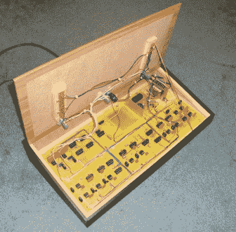

# 仅用 34 年就建成了实用的无线“远程网球”

> 原文：<https://hackaday.com/2022/05/30/practical-wireless-tele-tennis-build-after-only-34-years/>

Home-etched PCBs ready for drilling

早在 1974 年 11 月，出版物“实用无线”制作了一个五部分的文章系列，向读者展示如何构建一个版本的流行的“乒乓”游戏，该游戏可以在典型的英国家庭中的电视屏幕上播放。[Grant Searle]多年来一直想建造这个项目，但直到 2008 年他才找到机会。该杂志文章以 1:1 的比例打印了 PCB 布局，并附有材料清单和组装说明。每个月之后，读者会对项目有更多的了解，最后一个月专门用于点对点的布线和最终设置。随后的几个月中包含了一些改进，如评分系统和音效，但这些还不是主要构建的一部分。为了理解这个版本，你需要[下载杂志印刷的 PDF 副本](https://1drv.ms/u/s!AsDJV6EQwPVsckwDi3_t-tdCP8s?e=PCtAoT)。(如果你是一个像这位抄写员一样的电子书呆子，你已经这样做了，对吗？)

A tidy assembly job with an authentic retro style

电子器件基于纯离散 7400 系列逻辑、741 个基于运算放大器的斜坡发生器和 555 个定时器。各种电路板具有独立功能的方式非常有趣。例如，在第 3 部分中，所描述的 PCB(板 A)不仅是主场/行同步发生器，而且还产生球的视频信号，其位置和大小以模拟方式确定。从电路板 C(上/下基座)进入电路板的信号导致离散触发器触发，当球从屏幕边缘“反弹”时改变球的方向。每个板都产生自己的视频信号，然后在最终的视频混合器(板 E)中进行组合，并与复合同步信号进行线或运算，以产生所需的复合视频。这本来会被分接出来，并馈入一个超高频视频调制器，但[格兰特]选择不为建筑安装那个。整个东西被包裹在一个中密度纤维板的盒子里，包裹在可疑的假木塑料包装中，这是我们中的一些人深情地记得的 70 年代的美学。

Pong 是一款非常受欢迎的经典游戏，这些年来我们已经介绍了很多很多的变种。这里的[一个是纯机械的](https://hackaday.com/2022/03/23/old-school-mechanical-pong-still-amazes/)，另一个使用原始 PCB [和视觉上吸引人的扭曲](https://hackaday.com/2021/03/08/framed-pong-is-picture-perfect/)，最后，一个[完全虚拟模拟原始街机电路，由法尔斯塔德](https://hackaday.com/2022/04/06/pong-in-hardware-virtually/)提供。我们相信还会有更多。

谢谢[JohnU]的提示！