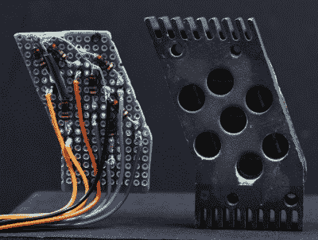

# 保存历史悠久的 NASA 显示技术

> 原文：<https://hackaday.com/2019/07/30/preserving-historic-nasa-display-technology/>

当[Patrick Hickey]在易贝花了一大笔钱购买阿波罗计划期间肯尼迪航天中心发射控制中心使用的一对七段显示器时，他本可以把它们放在一个架子上。大多数人肯定会这么做。相反，他决定研究并记录他们的设计，希望最终创造出这些 NASA 历史上独特片段的 3D 复制品。

随着半个世纪的到来，保护美国国家航空航天局在人类最伟大的冒险中使用的不可思议的技术比以往任何时候都重要。合法的阿波罗时代的硬件在公开市场上相当稀缺，当然也不便宜。正如[Patrick]在该项目的 Hackaday.io 页面上解释的那样，能够 3D 打印这些显示器的精确副本可能是我们确保它们不会消失在历史中的最佳方式。

 但不仅如此，他还希望其他人能够看到它们的运行，甚至可能在自己的项目中使用它们。因此，这意味着要拿出现代电子产品来替代最初为它们提供动力的 60 年代的硬件。

由于[Patrick]无法使用这些显示器最初使用的任何光源(可能是白炽灯),他的电子产品严格来说是功能性的，而不是一种历史性的娱乐尝试。但我们不得不说，不管怎样，效果看起来棒极了。

目前，[Patrick]正把大部分精力放在两种显示器中较小的一种上，他称之为“A 型”。带有集成散热片的轧制铝块具有相对简单的形状，[应该有助于通过 3D 扫描](https://hackaday.com/2019/03/13/3d-scanning-via-diy-photogrammetry/)甚至仅仅一对卡钳进行复制。他还整理了一份概念证明，展示了他打算如何在一块精心修整的原板上用 5 毫米 led 照明显示器，他计划最终对原板进行改进，以减少使用的电线数量。

他仍然有点不确定的一个方面是如何最好地复制正面面具。它似乎是由蚀刻金属制成的，带有集成的玻璃纤维扩散器，虽然他已经想出了一些可能的方法来为他的 3D 打印版本创建类似的前面板，但他肯定会接受社区的建议。

这并不是我们第一次看到[一个有献身精神的人使用 3D 打印来再造一个稀有而昂贵的物体](https://hackaday.com/2018/12/24/vintage-toys-live-on-through-3d-printing/)。虽然纯粹主义者会说挤压塑料版本比不上真正的东西，但我们认为这肯定比让这样的技术淡出人们的视线要好。