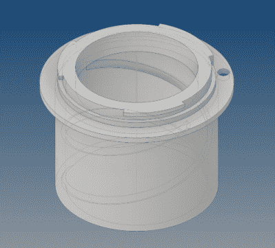

# 印刷适配器让复古镜头重新发挥作用

> 原文：<https://hackaday.com/2021/09/28/printed-adapter-puts-vintage-lens-back-to-work/>

在逛一家古董店时，[尼克·莫尔甘蒂]偶然发现了一台柯达幻灯机，正面悬挂着一个绝对巨大的镜头。这款德国制造的 ISCO 光学镜近一英尺长，前端直径约四英寸，售价仅为 10 美元。唯一棘手的部分是弄清楚如何在现代 DSLR 相机上使用它。

从投影仪上取下镜头后，[Nick]注意到镜头后部的直径似乎与老式胶片相机上流行的螺纹 M42 支架几乎相同。幸运的是，他已经有了一个适配器，可以在他的相机上使用旧的苏联 M42 镜头。螺距完全不匹配，但通过将镜头靠近适配器，他能够对焦距进行一些实验，并拍摄一些测试照片。

 在这些早期测试的鼓励下，【尼克】着手设计 3D 打印适配器。他的第一次尝试只不过是一对同心圆筒，像一个旧的手持望远镜一样聚焦。这很有效，但是用在已经很难看的镜头上就太挑剔了。他的第二次尝试增加了内部线程，这使他更容易控制焦点。在他对设计感到满意后，他在适配器上粘了一个小环，这样镜头就不会再被完全拧开而意外掉出。

对我们来说，这个项目是桌面 3D 打印的完美应用。[Nick]能够构思独一无二的设计，测试它，迭代它，并完成产品，所有这一切都无需离开自己舒适的家。更不用说适配器的复杂设计，通过传统方法生产这种适配器是非常困难的。也许有些人认为的美好时光是试着用木头削出一个镜头卡口，但这肯定不是我们的。

因此，这几年来我们看到许多类似的项目也就不足为奇了。从巨大的变形适配器到[为游戏机相机升级的光学系统](https://hackaday.com/2018/06/04/a-canon-lens-adapter-for-the-game-boy-camera/)，3D 打印和摄影社区之间似乎有一个健康的重叠。