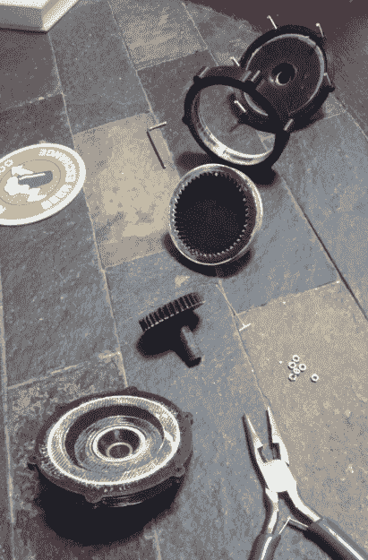

# 印刷部分获得经典卡车滚动

> 原文：<https://hackaday.com/2018/08/08/printed-part-gets-classic-truck-rolling/>

当在经典车辆上工作时，特别是当在它们的库存配置之外修改它们时，事情会变得昂贵。这是经济学的一个基本原则:越稀有的东西，别人就能向你要价越高。但是，如果你有技能和必要的设备，你可以偶尔通过自己定制制造一些零件来为自己省钱。

 在改变了他 1971 年的福特 F100 的传动比后，【smpstech】需要调整他的速度表来进行补偿。不幸的是，一个商用速度表减速器和连接到他仪表板上的新电缆将花费数百美元，所以他[决定尝试设计和 3D 打印他自己的变速箱](https://imgur.com/a/lEOG6Zx)。由此产生的开发过程和最终产品是一个完美的例子，说明即使是一台便宜的桌面 3D 打印机，在一个有能力的操作员手中，也可以做很多事情，而不仅仅是打印出小玩具船。

齿轮箱包含一个由较小的偏置正齿轮驱动的大齿圈。这种紧凑的直列式封装将输入轴的速度降低了 25.5%，这[SMP tech]提到实际上比必要的速度慢了一点，但如果他决定改变轮胎尺寸，这确实给他一些回旋的空间。

即使你不是在为一辆近 50 岁的卡车寻找一个速度表减速器，这里也有一些关于 3D 打印汽车零件的经验教训。他的变速箱的第一个版本，虽然最初功能正常，但在暴露于 F100 发动机舱内的温度后，最终看起来像一个泄气的气球。他的廉价 PLA 细丝，可能对前面提到的玩具船来说是好的，但根本不是合适的材料。

【smpstech】随后在 HTPLA 中转载了这个小工具，打印后需要退火才能达到全强度。通常这需要在烤箱中进行低温烘烤，但他发现在炉子上的一壶水中煨制零件能让他更好地控制温度。HTPLA 版本不仅更好地处理了引擎盖下的条件，而且足够强大，他能够在车速表电缆的连接上使用标准模具来创建螺纹，而不是必须建模和打印它们。如果常规的 PLA 不适合你，这绝对是一个值得关注的材料。

这不是我们第一次看到 [3D 打印零件被用来让一辆老爷车重新上路](https://hackaday.com/2018/02/17/repairs-you-can-print-a-turn-signal-switch-for-a-chevy-corvair/)。当然，如果没有 3D 打印机，建造这些定制零件是可能的，但这是一个很好的例子，说明了技术[如何使这些类型的修理更快更容易](https://hackaday.com/2018/02/15/printed-motorcycle-choke-lever-goes-the-distance/)。

[通过 [/r/functionalprint](https://www.reddit.com/r/functionalprint/comments/95bzac/inline_cable_speedometer_reducer/)