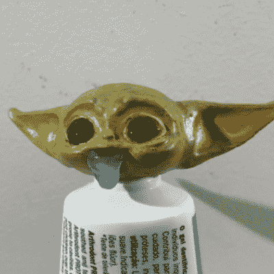

# 打印尤达头:重新制造商重复！

> 原文：<https://hackaday.com/2021/02/27/printing-yoda-heads-re-makers-riffing/>

我们最近收到了一个讨厌的小巨魔的评论(喘息！在网上！).这种说法是，大多数制造商实际上只是“抄袭者”，因为他们不是在做原创工作，不管这意味着什么，而是在重复别人已经做过的项目。打印其他人的 3D 模型，或者使用其他人的硬件或软件模块的人不一定有创造力。揭穿一个廉价巨魔是不够的，因为，在更深的思考中，我犯了同样的普遍情绪；那种抄袭他人作品不如自己创作的感觉。我认为这是错误的！

特别是在 3D 打印领域，我对轻蔑地将项目归类为“尤达头”感到内疚。大约十年前，[chylld]上传了一个干净的，高分辨率的[尤达](https://www.thingiverse.com/thing:14104)模型到 Thingiverse，大家都打印出来了。见鬼，我妻子的桌子上还有她的。单单这一点就证明了直接复制是有价值的，因为它是一份甜蜜的小礼物。过了一会儿，尤达让位于小精灵，奇怪的是我们又回到了尤达，但[现在是尤达宝宝](https://www.thingiverse.com/thing:4670686)。

 让世界充满更多的尤达头像，吐不吐牙膏，更进一步的创意？我认为是的。这实际上是一个中等难度的打印——那些细长的小耳朵提出了一个突出的挑战，这肯定会帮助你校准你的冷却，或者迫使你学习一些关于支撑的东西。挑战 3D 打印的极限让你了解这种工具，以及它带来的可能性。掌握一种工具是创造性使用它的重要一步。然后就是“即兴重复”。

爵士乐手不仅仅是站起来演奏那些神奇地出现在他们脑海中的即兴独奏。他们花了几个小时在小屋里，模仿其他玩家诠释经典的方式。也就是说，他们通过复制变得有创造力。超凡的、鼓舞人心的、原创的时刻通过你的手指、耳朵和嘴唇一小时又一小时地过滤其他人的作品，直到它成为你的一部分，并最终通过你的音乐感受力冒出来。

这同样适用于任何“衍生”项目。我们刚刚介绍了[一个基于音叉的时钟](https://hackaday.com/2021/02/13/tuning-fork-keeps-this-throwback-digital-clock-ticking/)，它是对[前生](https://hackaday.com/2019/08/29/impractical-clock-uses-tuning-fork/)的翻拍，但在重新制作的过程中，它变得更具后启示录的美感。我们已经看到了可能有 100 万个单词的时钟，但[t0mg]的这个版本是[漂亮地激光蚀刻在玻璃背面的油漆](https://hackaday.com/2021/02/21/this-slimline-word-clock-uses-laser-etching-to-keep-things-simple)上，让我想到你可以在镜子背面的涂层上做同样的事情。重复。我可以说上几个小时。

因此，重新制作别人的项目可能不那么性感，但它可能非常有价值。这是我们学习工具的方式，也是我们增加创造性词汇的方式，它给了我们一个机会去探索别人从内到外做过的很酷的事情。尽管我们的文化偏见反对抄袭，但抄袭应该被视为基本的技能培养。出去给自己印几个尤达头像(比喻)也不丢人！

This article is part of the Hackaday.com newsletter, delivered every seven days for each of the last 200+ weeks. It also includes our favorite articles from the last seven days that you can see on [the web version of the newsletter](https://mailchi.mp/hackaday.com/hackaday-newsletter-649368). Want this type of article to hit your inbox every Friday morning? [You should sign up](http://eepurl.com/gTMxQf)!