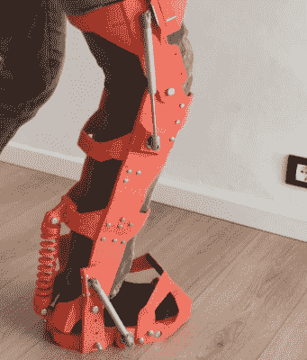

# 打印你自己的外骨骼

> 原文：<https://hackaday.com/2022/01/20/printing-your-own-exoskeleton/>

虽然不完全是在洞穴中，但用有限的工具制作自己的外骨骼的想法确实有托尼·斯塔克式的氛围。[Andrew Piccinno]是一名机械工程师[追求 3D 打印全身外骨骼的梦想，称为 3X0](https://hackaday.io/project/182971-3x0-3d-printable-exoskeleton-concept) 。这是一个他自大学以来就一直在反复思考的项目，但这项工作真正开始是在大约五个月前。不幸的是，[的照片太多了，无法在此一一列举，但请查看他的 Instagram](https://www.instagram.com/nozzle_torino/) 或 [makeprojects](https://makeprojects.com/project/3d-printable-functional-exoskeleton) 以获取更多照片。

为了确保各部分吻合，[安德鲁]开始为他的身体创建一个网格。在通过一些摄影测量软件运行了 50 张自己保持相对静止的照片后，他有了一个像样的网格。虽然测量不精确到毫米，但所有东西的相对尺寸都相当精确。虽然设计是根据他的尺寸建模的，但所有不同的部分都是参数化的，这在理论上允许某人调整设计以适应自己的身体。

到目前为止，除了钢珠轴承、气体活塞和张力带之外，所有部件都已经完全 3D 打印出来了。非 3D 打印的零件很容易获得，因为气体活塞只是 100 N 个家具活塞。设计过程包括相当多的数学、运动研究和模拟，以确保他打印的部分不仅适合，而且移动正确。许多部件，如肩膀，都是围绕一个大型定制轴承构建的，使该部件能够随着用户的关节正确移动。

虽然还在开发中，[Andrew]已经取得了一些重大进展，我们期待看到它的完成。目前的设计主要是被动的，只有几个弹簧和活塞，但他已经期待着让它变得主动，以增加用户的运动，而不仅仅是减轻负荷。很明显，[安德鲁]相信外骨骼是对潜在未来的展望，我们完全同意。同样，也许这个预算有限的动力外骨骼臂中使用的[技术可以用来驱动 3X0？](https://hackaday.com/2019/08/02/an-exoskeleton-arm-for-a-hacker-on-a-budget/)