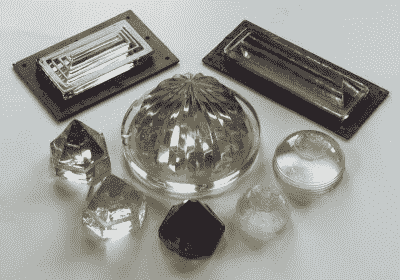
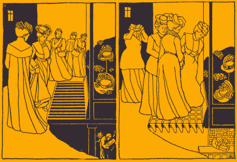
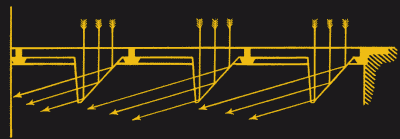
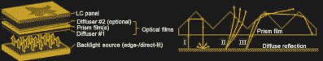

# 棱镜照明——控制日光的艺术

> 原文：<https://hackaday.com/2020/11/09/prism-lighting-the-art-of-steering-daylight/>

白炽灯泡是电最早的应用之一，很难低估它的重要性。但是在电灯出现之前，人们并没有生活在黑暗中——他们想办法改变阳光的方向来照亮室内空间。这是通过对光学基本原理的理解和建造棱镜瓦、甲板棱镜和拱顶灯的熟练玻璃制造者的工作而成为可能的。这些已有一个世纪历史的技术今天仍被应用于 led 的扩散或增加 LCD 显示器的亮度。

## 语义第一！

当谈到棱镜的定义时，光学界的人有点草率。虽然它们中的许多肯定不是几何棱镜，但维基百科将其定义为一种透明的光学元件，具有平坦、抛光的表面，其中至少有一个是有角度的。从下面的图片中可以看出，这里的一些棱镜甚至不符合这个定义。浏览你最喜欢的光学供应商的目录，你会发现[各种各样的棱镜](https://www.thorlabs.com/navigation.cfm?guide_id=20)用于反射、倒置、旋转、分散、控制和准直光线。需要指出的是，我们对将一束白光分成不同颜色光谱的色散棱镜并不感兴趣，尽管它们使[成为伟大的专辑封面](https://en.wikipedia.org/wiki/The_Dark_Side_of_the_Moon)。本文中棱镜的重要属性是它们通过折射和反射重定向光的能力。

## 将光线带到甲板下的安全方法

A collection of deck lights used to direct sunlight below deck in ships. Credit: [glassian.org](https://www.glassian.org/Prism/)

棱镜照明最重要的用途之一是在船上。在木船上，明火可能会造成灾难性的后果，因此安装了甲板棱镜，作为将阳光直射到甲板下区域的一种手段。早在 1684 年，Edward Wyndus 就申请了首个甲板灯专利[“非凡的玻璃和灯具带来的巨大而持久的增光效果”](https://www.glassian.org/Prism/Patent/GB1684232/page1.html)。甲板棱镜的典型尺寸为 10 至 15 厘米。平顶与甲板齐平安装，阳光从棱镜点折射并向下照射。由于光路的可逆性(“如果我能看到你，你也能看到我”)，甲板棱镜也有助于发现甲板下的火灾。

## 让女性购物更容易

The shopping experience in the 19th century was much improved after the invention of vault lights. Credit: [glassian.org](https://www.glassian.org/Prism/)

在 19 世纪，棱镜照明的想法被应用于拱顶灯，将阳光导入人行道拱顶和地下室。与开放式格栅相比，这些格栅不仅可以防雨，而且更容易行走。后者显然被认为是店主的一大优势，可以帮助他们让女性更靠近他们的橱窗，尽管她们穿着不实用的鞋子。

Prism shaped pavement light redirecting sunlight through total internal reflection. Credit: [glassian.org](https://www.glassian.org/Prism/)

起初，拱顶盖使用圆形平凸透镜，甚至只是平板玻璃。在船甲板上使用的棱镜形状只是后来爱德华·海沃德在 1871 年才适用于拱顶灯。他的玻璃棱镜不仅能让光线通过，还能让光线侧向进入房间。海沃德的棱镜是基于[全内反射](https://en.wikipedia.org/wiki/Total_internal_reflection)，当光试图以超过临界角的角度离开玻璃时，就会发生全内反射。

## 从棱镜瓦片到气瓶

最终，棱镜玻璃也被应用到垂直窗户上，取得了巨大的商业成功。这场游戏中最大的玩家是 Luxfer Prism 公司，该公司于 1897 年开始销售基于 James G. Pennycuick 的早期[专利的棱镜瓷砖。4 英寸宽的正方形 Luxfer 瓷砖通常安装在店面窗户的上方。](https://www.glassian.org/Prism/Patent/312290/page1.html)

Nice tiles on a storefront. Credit: [Luxfer Prism Glass Tile Collector.](https://luxferprismglasstilecollector.weebly.com/)

瓷砖的内表面覆盖着水平棱镜，将光线重新引导到比阳光本身更深的地方。

尽管他们的商业成功因廉价电灯的出现而停止，但在美国的许多小镇上仍然可以看到这种瓷砖。Luxfer 公司通过将其业务转向金属产品而生存下来，现在是世界上最大的高压铝储气瓶制造商。Luxfer 瓷砖通常包含由当时的主要建筑师设计的装饰图案，现在是收藏家的物品。弗兰克·劳埃德·赖特是一个高调的支持者。

## LED 扩散器和液晶显示屏

虽然现在电力很便宜，led 与白炽灯相比效率极高，但更有效地利用阳光进行室内照明无疑是一个值得追求的目标，如果不仅仅是为了出色的色彩再现的话。现代版的棱镜片是日光重定向窗膜。薄塑料薄膜包括微结构锯齿图案，将光线向上折射到天花板，并从天花板反射到建筑物的更深处——相当于 Luxfer 瓷砖的薄塑料。据 3M 公司称，这种薄膜可以节省高达 52%的照明能源成本。

Typical configuration of an LCD screen and working principle of the prism film: ray I is totally reflected and recycled by diffuse reflection, ray II is converged by the prism refraction, and ray III is recycled by other prisms. Credit: [Zong Qin](https://www.sciencedirect.com/science/article/abs/pii/S0141938217300884?via%3Dihub)

你可能已经对棱镜薄膜很熟悉了，以防你正在寻找扩散 led 的方法。由聚苯乙烯或聚碳酸酯制成的微棱镜片是使 LED 阵列的光均匀化的常见解决方案。此外，如果你曾经拆过 LCD 屏幕，你会注意到玻璃下面夹着几块塑料片。这些还包含棱镜膜，以提高背光屏幕的亮度。

如图所示，棱镜膜将光汇聚到观察者，从而增加了轴上亮度，同时限制了视角。通常这些薄膜中的两个以 90 度旋转堆叠，以在水平面和垂直面上会聚光线。

这些薄膜也开始出现在高端 LED 照明应用中，在它们变得无处不在之前，这可能只是时间和价格的问题。白炽灯泡杀死了棱镜，led 杀死了白炽灯，棱镜正在被重新发现。旧的又是新的！

棱镜在某种程度上是光学的瑞士军刀，是控制光线的多用途工具。即使几个世纪以来制造技术、材料、形状和尺寸发生了变化，改变光的方向使其穿过简单形状的透明体的能力仍然有许多有用的应用。