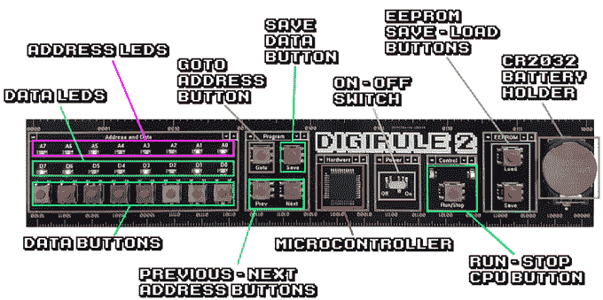

# 可编程尺子让 20 世纪 70 年代的计算保持活力

> 原文：<https://hackaday.com/2019/03/02/programmable-ruler-keeps-1970s-computing-alive/>

尺子似乎是一个非常简单的装置；只是一块很直的材料，上面有一些标记。基本设计有一些改进，比如用一些灵活的东西制作它，或者在上面打印一些有用的笔记和公式，这样你就有一个方便的参考。但是在很大程度上，我们都同意标尺技术已经达到了一个相当稳定的水平。

 好吧，如果[布拉德]有什么要说的，就不会了。他的最新发明 Digirule2 本质上是一台类似于 20 世纪 70 年代的 8 位计算机，恰好也是一把功能性的尺子。下次当你有心情进行一些老式的软件开发时，不要再拖着 Altair 8800 了，现在你可以用一个装在你的笔筒里的硬件获得同样的体验。

即使你从未指挥过启发了 Digirule2 的闪光灯巨兽，这也是获得早期计算机技术实践经验的绝佳方式。在 Tindie 上可以买到一个大披萨的价格，这是告诉你的朋友事实上你*已经*用二进制编程了一台计算机的最简单和最划算的方法之一。

Digirule2 由一个微芯片 PIC18F43K20 供电，通过一组八个触觉开关一次一个字节地输入二进制来编程。为了让事情变得简单一点，程序可以保存到内部 EEPROM，并加载回来一样容易，这要归功于电源开关旁边的便捷按钮。现在你所要做的就是弄清楚那些闪烁的发光二极管是什么意思，然后你就可以做生意了。

最初的 [Digirule 是一个逻辑门模拟器，我们在 2015 年](https://hackaday.com/2015/10/13/electronic-ruler-works-out-logic-truth-tables/)首次介绍过。我们总是很高兴看到项目随着时间的推移而增长和发展，并认为这种新的复古计算机主题的变体将会在那些仍然喜欢拨动开关和闪烁灯光的人当中很受欢迎。

 [https://www.youtube.com/embed/fQLPlUDju5k?version=3&rel=1&showsearch=0&showinfo=1&iv_load_policy=1&fs=1&hl=en-US&autohide=2&wmode=transparent](https://www.youtube.com/embed/fQLPlUDju5k?version=3&rel=1&showsearch=0&showinfo=1&iv_load_policy=1&fs=1&hl=en-US&autohide=2&wmode=transparent)

